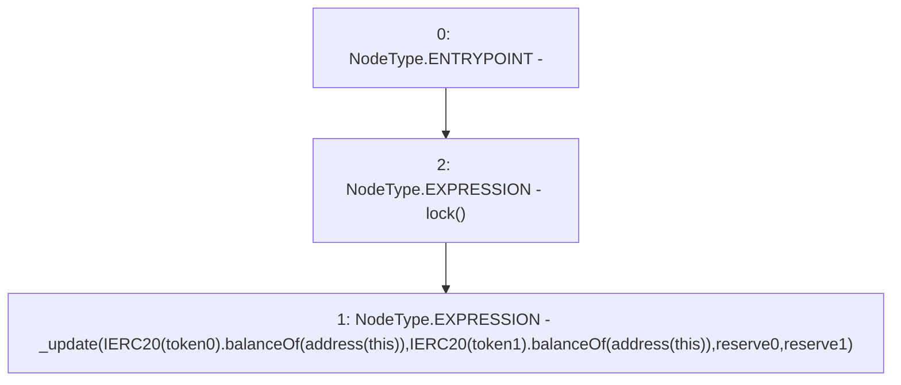

# Context: UniswapV2Pair.sync

**Contract:** `UniswapV2Pair` (Inherits: UniswapV2ERC20, IUniswapV2Pair, IUniswapV2ERC20)
**Signature:** `sync()`
**Method Selector ID:** `0xfff6cae9`
**Visibility:** `external`
**Environment-Free:** `No (reads EVM state context)`
**Modifiers:**
- `lock`
  ```solidity
  modifier lock() {
          require(unlocked == 1, "UniswapV2: LOCKED");
          unlocked = 0;
          _;
          unlocked = 1;
      }
  ```

### State Variables Interaction
- **Reads:** reserve0, reserve1, token0, token1
- **Writes:** None

### Environment & Verification Flags
- **Uses Foundry Cheatcodes:** No
- **Has Echidna Properties:** No

### Internal Calls Tree
- None

### External Calls / Value Transfers
- `IERC20.TMP_266(uint256) = HIGH_LEVEL_CALL, dest:TMP_264(IERC20), function:balanceOf, arguments:['TMP_265']  `
- `IERC20.TMP_263(uint256) = HIGH_LEVEL_CALL, dest:TMP_261(IERC20), function:balanceOf, arguments:['TMP_262']  `

### Control Flow Graph (CFG)


### Source Mapping
Declared in: `certora-ac-datasets/detasets/web3bugs/dataset/web3bugs/52/contracts/external/UniswapV2Pair.sol` on lines **268** to **275**

```solidity
    function sync() external lock {
        _update(
            IERC20(token0).balanceOf(address(this)),
            IERC20(token1).balanceOf(address(this)),
            reserve0,
            reserve1
        );
    }

```
