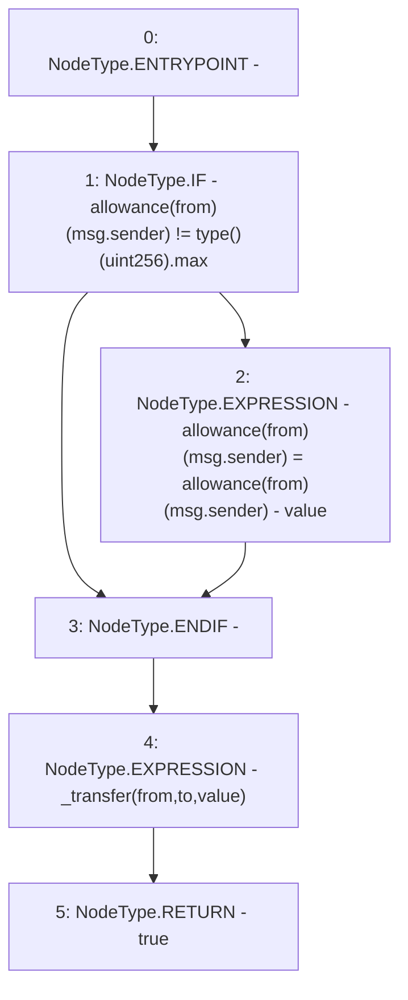

# Context: UniswapV2Pair.transferFrom

**Contract:** `UniswapV2Pair` (Inherits: UniswapV2ERC20, IUniswapV2Pair, IUniswapV2ERC20)
**Signature:** `transferFrom(address,address,uint256) returns (bool)`
**Method Selector ID:** `0x23b872dd`
**Visibility:** `external`
**Environment-Free:** `No (reads EVM state context)`
**Modifiers:** None

### State Variables Interaction
- **Reads:** allowance
- **Writes:** allowance

### Environment & Verification Flags
- **Uses Foundry Cheatcodes:** No
- **Has Echidna Properties:** No

### Internal Calls Tree
- None

### External Calls / Value Transfers
- None

### Control Flow Graph (CFG)


### Source Mapping
Declared in: `certora-ac-datasets/detasets/web3bugs/dataset/web3bugs/52/contracts/external/UniswapV2ERC20.sol` on lines **80** to **90**

```solidity
    function transferFrom(
        address from,
        address to,
        uint256 value
    ) external returns (bool) {
        if (allowance[from][msg.sender] != type(uint256).max) {
            allowance[from][msg.sender] = allowance[from][msg.sender] - value;
        }
        _transfer(from, to, value);
        return true;
    }

```
