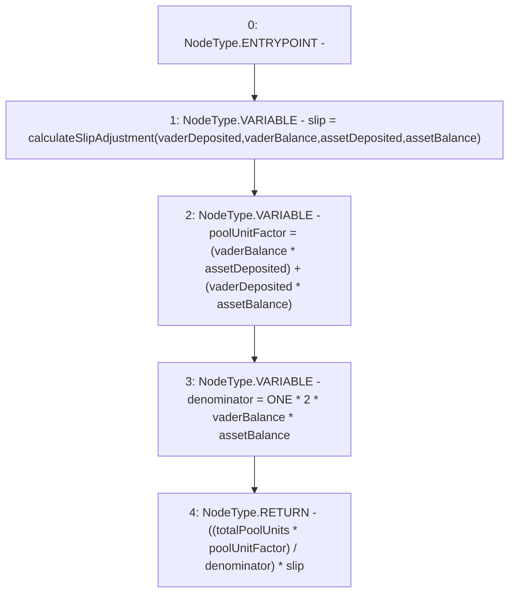

# Context: VaderMath.calculateLiquidityUnits

**Contract:** `VaderMath` (Inherits: None)
**Signature:** `calculateLiquidityUnits(uint256,uint256,uint256,uint256,uint256) returns (uint256)`
**Method Selector ID:** `0x0bd92c25`
**Visibility:** `public`
**Environment-Free:** `Yes`
**Modifiers:** None

### State Variables Interaction
- **Reads:** ONE
- **Writes:** None

### Environment & Verification Flags
- **Uses Foundry Cheatcodes:** No
- **Has Echidna Properties:** No

### Internal Calls Tree
- None

### External Calls / Value Transfers
- None

### Control Flow Graph (CFG)


### Source Mapping
Declared in: `certora-ac-datasets/detasets/web3bugs/dataset/web3bugs/52/contracts/dex/math/VaderMath.sol` on lines **19** to **43**

```solidity
    function calculateLiquidityUnits(
        uint256 vaderDeposited,
        uint256 vaderBalance,
        uint256 assetDeposited,
        uint256 assetBalance,
        uint256 totalPoolUnits
    ) public pure returns (uint256) {
        // slipAdjustment
        uint256 slip = calculateSlipAdjustment(
            vaderDeposited,
            vaderBalance,
            assetDeposited,
            assetBalance
        );

        // (Va + vA)
        uint256 poolUnitFactor = (vaderBalance * assetDeposited) +
            (vaderDeposited * assetBalance);

        // 2VA
        uint256 denominator = ONE * 2 * vaderBalance * assetBalance;

        // P * [(Va + vA) / (2 * V * A)] * slipAdjustment
        return ((totalPoolUnits * poolUnitFactor) / denominator) * slip;
    }

```
