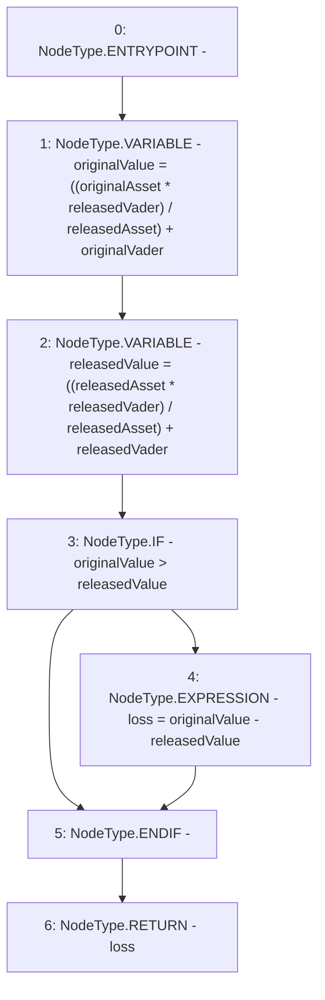

# Context: VaderMath.calculateLoss

**Contract:** `VaderMath` (Inherits: None)
**Signature:** `calculateLoss(uint256,uint256,uint256,uint256) returns (uint256)`
**Method Selector ID:** `0xbfc40edd`
**Visibility:** `public`
**Environment-Free:** `Yes`
**Modifiers:** None

### State Variables Interaction
- **Reads:** None
- **Writes:** None

### Environment & Verification Flags
- **Uses Foundry Cheatcodes:** No
- **Has Echidna Properties:** No

### Internal Calls Tree
- None

### External Calls / Value Transfers
- None

### Control Flow Graph (CFG)


### Source Mapping
Declared in: `certora-ac-datasets/detasets/web3bugs/dataset/web3bugs/52/contracts/dex/math/VaderMath.sol` on lines **73** to **93**

```solidity
    function calculateLoss(
        uint256 originalVader,
        uint256 originalAsset,
        uint256 releasedVader,
        uint256 releasedAsset
    ) public pure returns (uint256 loss) {
        //
        // TODO: Vader Formula Differs https://github.com/vetherasset/vaderprotocol-contracts/blob/main/contracts/Utils.sol#L347-L356
        //

        // [(A0 * P1) + V0]
        uint256 originalValue = ((originalAsset * releasedVader) /
            releasedAsset) + originalVader;

        // [(A1 * P1) + V1]
        uint256 releasedValue = ((releasedAsset * releasedVader) /
            releasedAsset) + releasedVader;

        // [(A0 * P1) + V0] - [(A1 * P1) + V1]
        if (originalValue > releasedValue) loss = originalValue - releasedValue;
    }

```
