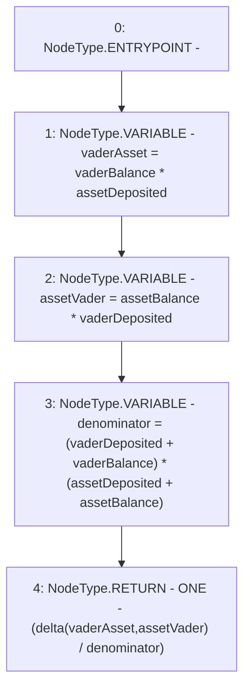

# Context: VaderMath.calculateSlipAdjustment

**Contract:** `VaderMath` (Inherits: None)
**Signature:** `calculateSlipAdjustment(uint256,uint256,uint256,uint256) returns (uint256)`
**Method Selector ID:** `0x1169c5d4`
**Visibility:** `public`
**Environment-Free:** `Yes`
**Modifiers:** None

### State Variables Interaction
- **Reads:** ONE
- **Writes:** None

### Environment & Verification Flags
- **Uses Foundry Cheatcodes:** No
- **Has Echidna Properties:** No

### Internal Calls Tree
- None

### External Calls / Value Transfers
- None

### Control Flow Graph (CFG)


### Source Mapping
Declared in: `certora-ac-datasets/detasets/web3bugs/dataset/web3bugs/52/contracts/dex/math/VaderMath.sol` on lines **49** to **67**

```solidity
    function calculateSlipAdjustment(
        uint256 vaderDeposited,
        uint256 vaderBalance,
        uint256 assetDeposited,
        uint256 assetBalance
    ) public pure returns (uint256) {
        // Va
        uint256 vaderAsset = vaderBalance * assetDeposited;

        // aV
        uint256 assetVader = assetBalance * vaderDeposited;

        // (v + V) * (a + A)
        uint256 denominator = (vaderDeposited + vaderBalance) *
            (assetDeposited + assetBalance);

        // 1 - [|Va - aV| / (v + V) * (a + A)]
        return ONE - (delta(vaderAsset, assetVader) / denominator);
    }

```
