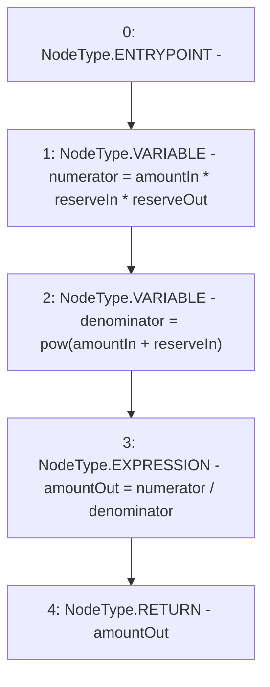

# Context: VaderMath.calculateSwap

**Contract:** `VaderMath` (Inherits: None)
**Signature:** `calculateSwap(uint256,uint256,uint256) returns (uint256)`
**Method Selector ID:** `0xec6341b3`
**Visibility:** `public`
**Environment-Free:** `Yes`
**Modifiers:** None

### State Variables Interaction
- **Reads:** None
- **Writes:** None

### Environment & Verification Flags
- **Uses Foundry Cheatcodes:** No
- **Has Echidna Properties:** No

### Internal Calls Tree
- None

### External Calls / Value Transfers
- None

### Control Flow Graph (CFG)


### Source Mapping
Declared in: `certora-ac-datasets/detasets/web3bugs/dataset/web3bugs/52/contracts/dex/math/VaderMath.sol` on lines **99** to **111**

```solidity
    function calculateSwap(
        uint256 amountIn,
        uint256 reserveIn,
        uint256 reserveOut
    ) public pure returns (uint256 amountOut) {
        // x * Y * X
        uint256 numerator = amountIn * reserveIn * reserveOut;

        // (x + X) ^ 2
        uint256 denominator = pow(amountIn + reserveIn);

        amountOut = numerator / denominator;
    }

```
