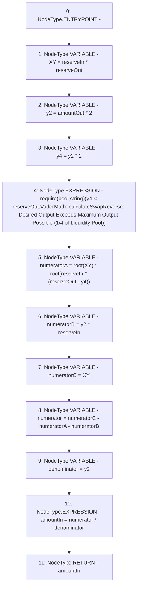

# Context: VaderMath.calculateSwapReverse

**Contract:** `VaderMath` (Inherits: None)
**Signature:** `calculateSwapReverse(uint256,uint256,uint256) returns (uint256)`
**Method Selector ID:** `0x3ae5c69b`
**Visibility:** `public`
**Environment-Free:** `Yes`
**Modifiers:** None

### State Variables Interaction
- **Reads:** None
- **Writes:** None

### Assertion Checks & Business Requirements
- require/assert: `require(bool,string)(y4 < reserveOut,VaderMath::calculateSwapReverse: Desired Output Exceeds Maximum Output Possible (1/4 of Liquidity Pool))`

### Environment & Verification Flags
- **Uses Foundry Cheatcodes:** No
- **Has Echidna Properties:** No

### Internal Calls Tree
- None

### External Calls / Value Transfers
- None

### Control Flow Graph (CFG)


### Source Mapping
Declared in: `certora-ac-datasets/detasets/web3bugs/dataset/web3bugs/52/contracts/dex/math/VaderMath.sol` on lines **117** to **150**

```solidity
    function calculateSwapReverse(
        uint256 amountOut,
        uint256 reserveIn,
        uint256 reserveOut
    ) public pure returns (uint256 amountIn) {
        // X * Y
        uint256 XY = reserveIn * reserveOut;

        // 2y
        uint256 y2 = amountOut * 2;

        // 4y
        uint256 y4 = y2 * 2;

        require(
            y4 < reserveOut,
            "VaderMath::calculateSwapReverse: Desired Output Exceeds Maximum Output Possible (1/4 of Liquidity Pool)"
        );

        // root(-X^2 * Y * (4y - Y))    =>    root(X^2 * Y * (Y - 4y)) as Y - 4y >= 0    =>    Y >= 4y holds true
        uint256 numeratorA = root(XY) * root(reserveIn * (reserveOut - y4));

        // X * (2y - Y)    =>    2yX - XY
        uint256 numeratorB = y2 * reserveIn;
        uint256 numeratorC = XY;

        // -1 * (root(-X^2 * Y * (4y - Y)) + (X * (2y - Y)))    =>    -1 * (root(X^2 * Y * (Y - 4y)) + 2yX - XY)    =>    XY - root(X^2 * Y * (Y - 4y) - 2yX
        uint256 numerator = numeratorC - numeratorA - numeratorB;

        // 2y
        uint256 denominator = y2;

        amountIn = numerator / denominator;
    }

```
