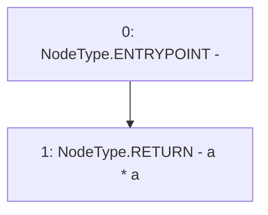

# Context: VaderMath.pow

**Contract:** `VaderMath` (Inherits: None)
**Signature:** `pow(uint256) returns (uint256)`
**Method Selector ID:** `0xb48d82cd`
**Visibility:** `public`
**Environment-Free:** `Yes`
**Modifiers:** None

### State Variables Interaction
- **Reads:** None
- **Writes:** None

### Environment & Verification Flags
- **Uses Foundry Cheatcodes:** No
- **Has Echidna Properties:** No

### Internal Calls Tree
- None

### External Calls / Value Transfers
- None

### Control Flow Graph (CFG)


### Source Mapping
Declared in: `certora-ac-datasets/detasets/web3bugs/dataset/web3bugs/52/contracts/dex/math/VaderMath.sol` on lines **162** to **164**

```solidity
    function pow(uint256 a) public pure returns (uint256) {
        return a * a;
    }

```
