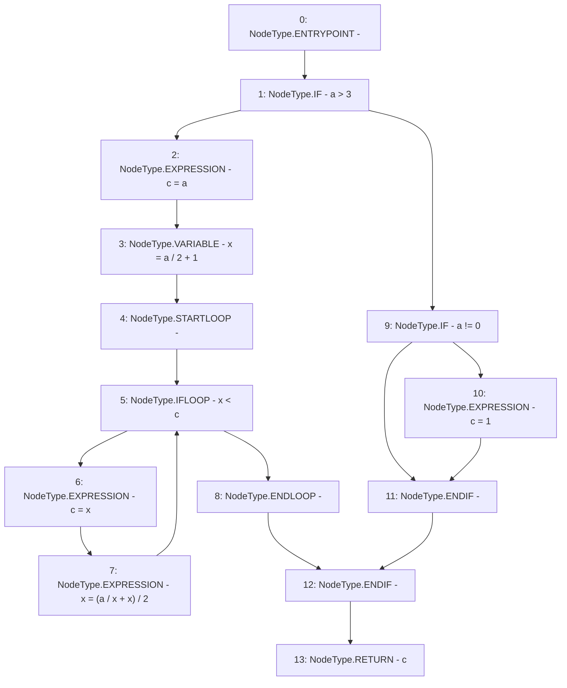

# Context: VaderMath.root

**Contract:** `VaderMath` (Inherits: None)
**Signature:** `root(uint256) returns (uint256)`
**Method Selector ID:** `0xe56bf027`
**Visibility:** `public`
**Environment-Free:** `Yes`
**Modifiers:** None

### State Variables Interaction
- **Reads:** None
- **Writes:** None

### Environment & Verification Flags
- **Uses Foundry Cheatcodes:** No
- **Has Echidna Properties:** No

### Internal Calls Tree
- None

### External Calls / Value Transfers
- None

### Control Flow Graph (CFG)


### Source Mapping
Declared in: `certora-ac-datasets/detasets/web3bugs/dataset/web3bugs/52/contracts/dex/math/VaderMath.sol` on lines **170** to **181**

```solidity
    function root(uint256 a) public pure returns (uint256 c) {
        if (a > 3) {
            c = a;
            uint256 x = a / 2 + 1;
            while (x < c) {
                c = x;
                x = (a / x + x) / 2;
            }
        } else if (a != 0) {
            c = 1;
        }
    }

```
