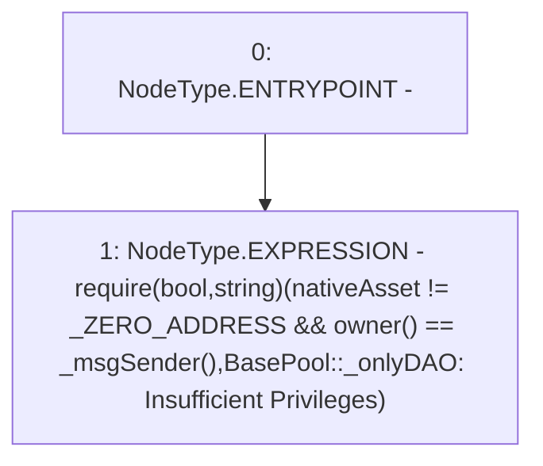

# Context: VaderPoolFactory._onlyDAO

**Contract:** `VaderPoolFactory` (Inherits: Ownable, Context, ProtocolConstants, IVaderPoolFactory)
**Signature:** `_onlyDAO()`
**Method Selector ID:** `Internal (No Method ID)`
**Visibility:** `private`
**Environment-Free:** `No (reads EVM state context)`
**Modifiers:** None

### State Variables Interaction
- **Reads:** _ZERO_ADDRESS, nativeAsset
- **Writes:** None

### Assertion Checks & Business Requirements
- require/assert: `require(bool,string)(nativeAsset != _ZERO_ADDRESS && owner() == _msgSender(),BasePool::_onlyDAO: Insufficient Privileges)`

### Environment & Verification Flags
- **Uses Foundry Cheatcodes:** No
- **Has Echidna Properties:** No

### Internal Calls Tree
- None

### External Calls / Value Transfers
- None

### Control Flow Graph (CFG)


### Source Mapping
Declared in: `certora-ac-datasets/detasets/web3bugs/dataset/web3bugs/52/contracts/dex/pool/VaderPoolFactory.sol` on lines **130** to **135**

```solidity
    function _onlyDAO() private view {
        require(
            nativeAsset != _ZERO_ADDRESS && owner() == _msgSender(),
            "BasePool::_onlyDAO: Insufficient Privileges"
        );
    }

```
