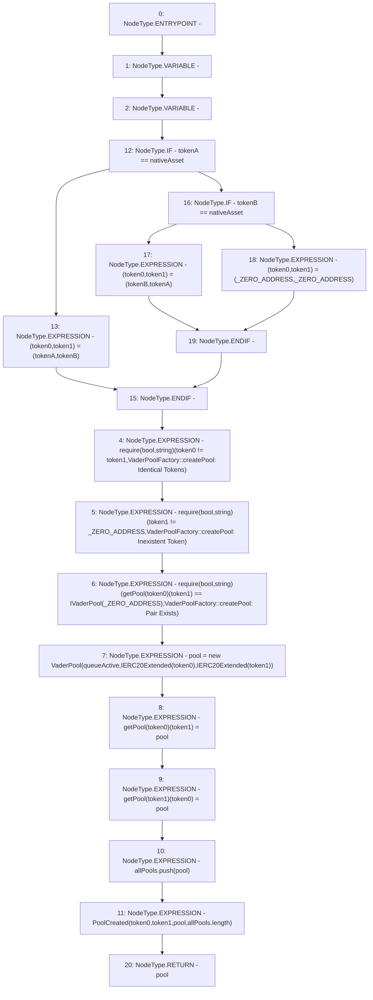

# Context: VaderPoolFactory.createPool

**Contract:** `VaderPoolFactory` (Inherits: Ownable, Context, ProtocolConstants, IVaderPoolFactory)
**Signature:** `createPool(address,address) returns (IVaderPool)`
**Method Selector ID:** `0xe3433615`
**Visibility:** `external`
**Environment-Free:** `Yes`
**Modifiers:** None

### State Variables Interaction
- **Reads:** _ZERO_ADDRESS, allPools, getPool, nativeAsset, queueActive
- **Writes:** allPools, getPool

### Assertion Checks & Business Requirements
- require/assert: `require(bool,string)(token0 != token1,VaderPoolFactory::createPool: Identical Tokens)`
- require/assert: `require(bool,string)(token1 != _ZERO_ADDRESS,VaderPoolFactory::createPool: Inexistent Token)`
- require/assert: `require(bool,string)(getPool[token0][token1] == IVaderPool(_ZERO_ADDRESS),VaderPoolFactory::createPool: Pair Exists)`

### Environment & Verification Flags
- **Uses Foundry Cheatcodes:** No
- **Has Echidna Properties:** No

### Internal Calls Tree
- None

### External Calls / Value Transfers
- None

### Control Flow Graph (CFG)


### Source Mapping
Declared in: `certora-ac-datasets/detasets/web3bugs/dataset/web3bugs/52/contracts/dex/pool/VaderPoolFactory.sol` on lines **54** to **89**

```solidity
    function createPool(address tokenA, address tokenB)
        external
        override
        returns (IVaderPool pool)
    {
        (address token0, address token1) = tokenA == nativeAsset
            ? (tokenA, tokenB)
            : tokenB == nativeAsset
            ? (tokenB, tokenA)
            : (_ZERO_ADDRESS, _ZERO_ADDRESS);

        require(
            token0 != token1,
            "VaderPoolFactory::createPool: Identical Tokens"
        );

        require(
            token1 != _ZERO_ADDRESS,
            "VaderPoolFactory::createPool: Inexistent Token"
        );

        require(
            getPool[token0][token1] == IVaderPool(_ZERO_ADDRESS),
            "VaderPoolFactory::createPool: Pair Exists"
        ); // single check is sufficient

        pool = new VaderPool(
            queueActive,
            IERC20Extended(token0),
            IERC20Extended(token1)
        );
        getPool[token0][token1] = pool;
        getPool[token1][token0] = pool; // populate mapping in the reverse direction
        allPools.push(pool);
        emit PoolCreated(token0, token1, pool, allPools.length);
    }

```
