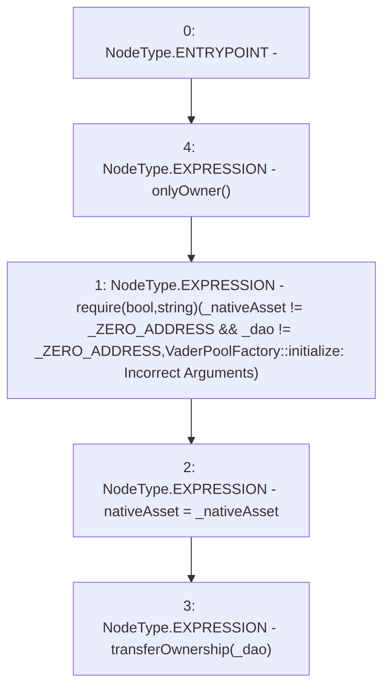

# Context: VaderPoolFactory.initialize

**Contract:** `VaderPoolFactory` (Inherits: Ownable, Context, ProtocolConstants, IVaderPoolFactory)
**Signature:** `initialize(address,address)`
**Method Selector ID:** `0x485cc955`
**Visibility:** `external`
**Environment-Free:** `No (reads EVM state context)`
**Modifiers:**
- `onlyOwner`
  ```solidity
  modifier onlyOwner() {
          _checkOwner();
          _;
      }
  ```

### State Variables Interaction
- **Reads:** _ZERO_ADDRESS
- **Writes:** nativeAsset

### Assertion Checks & Business Requirements
- require/assert: `require(bool,string)(_nativeAsset != _ZERO_ADDRESS && _dao != _ZERO_ADDRESS,VaderPoolFactory::initialize: Incorrect Arguments)`

### Environment & Verification Flags
- **Uses Foundry Cheatcodes:** No
- **Has Echidna Properties:** No

### Internal Calls Tree
- None

### External Calls / Value Transfers
- None

### Control Flow Graph (CFG)


### Source Mapping
Declared in: `certora-ac-datasets/detasets/web3bugs/dataset/web3bugs/52/contracts/dex/pool/VaderPoolFactory.sol` on lines **101** to **109**

```solidity
    function initialize(address _nativeAsset, address _dao) external onlyOwner {
        require(
            _nativeAsset != _ZERO_ADDRESS && _dao != _ZERO_ADDRESS,
            "VaderPoolFactory::initialize: Incorrect Arguments"
        );

        nativeAsset = _nativeAsset;
        transferOwnership(_dao);
    }

```
