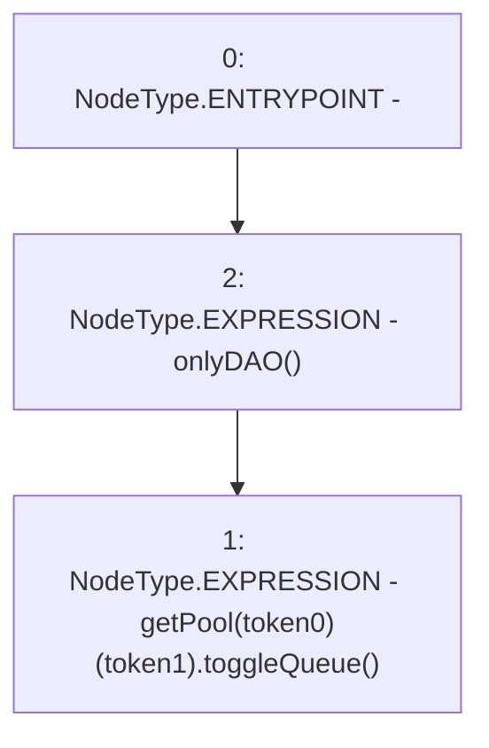

# Context: VaderPoolFactory.toggleQueue

**Contract:** `VaderPoolFactory` (Inherits: Ownable, Context, ProtocolConstants, IVaderPoolFactory)
**Signature:** `toggleQueue(address,address)`
**Method Selector ID:** `0xc7a3414b`
**Visibility:** `external`
**Environment-Free:** `No (reads EVM state context)`
**Modifiers:**
- `onlyDAO`
  ```solidity
  modifier onlyDAO() {
          _onlyDAO();
          _;
      }
  ```

### State Variables Interaction
- **Reads:** getPool
- **Writes:** None

### Environment & Verification Flags
- **Uses Foundry Cheatcodes:** No
- **Has Echidna Properties:** No

### Internal Calls Tree
- None

### External Calls / Value Transfers
- `IVaderPool.HIGH_LEVEL_CALL, dest:REF_234(IVaderPool), function:toggleQueue, arguments:[]  `

### Control Flow Graph (CFG)


### Source Mapping
Declared in: `certora-ac-datasets/detasets/web3bugs/dataset/web3bugs/52/contracts/dex/pool/VaderPoolFactory.sol` on lines **117** to **119**

```solidity
    function toggleQueue(address token0, address token1) external onlyDAO {
        getPool[token0][token1].toggleQueue();
    }

```
