# Context: VaderPoolV2._burn

**Contract:** `VaderPoolV2` (Inherits: Ownable, BasePoolV2, ReentrancyGuard, ERC721, IERC721Metadata, IVaderPoolV2, IERC721, ERC165, IERC165, Context, GasThrottle, ProtocolConstants, IBasePoolV2)
**Signature:** `_burn(uint256,address) returns (uint256, uint256)`
**Method Selector ID:** `Internal (No Method ID)`
**Visibility:** `internal`
**Environment-Free:** `No (reads EVM state context)`
**Modifiers:**
- `nonReentrant`
  ```solidity
  modifier nonReentrant() {
          _nonReentrantBefore();
          _;
          _nonReentrantAfter();
      }
  ```

### State Variables Interaction
- **Reads:** nativeAsset, pairInfo, positions
- **Writes:** pairInfo

### Assertion Checks & Business Requirements
- require/assert: `require(bool,string)(ownerOf(id) == address(this),BasePoolV2::burn: Incorrect Ownership)`
- require/assert: `require(bool,string)(amountNative > 0 && amountForeign > 0,BasePoolV2::burn: Insufficient Liquidity Burned)`

### Environment & Verification Flags
- **Uses Foundry Cheatcodes:** No
- **Has Echidna Properties:** No

### Internal Calls Tree
- None

### External Calls / Value Transfers
- `SafeERC20.LIBRARY_CALL, dest:SafeERC20, function:SafeERC20.safeTransfer(IERC20,address,uint256), arguments:['nativeAsset', 'to', 'amountNative'] `
- `SafeERC20.LIBRARY_CALL, dest:SafeERC20, function:SafeERC20.safeTransfer(IERC20,address,uint256), arguments:['foreignAsset', 'to', 'amountForeign'] `

### Control Flow Graph (CFG)

```mermaid
flowchart TD
    Node_0["0: NodeType.ENTRYPOINT - "]
    Node_0 --> Node_18
    Node_1["1: NodeType.EXPRESSION - require(bool,string)(ownerOf(id) == address(this),BasePoolV2::burn: Incorrect Ownership)"]
    Node_1 --> Node_2
    Node_2["2: NodeType.VARIABLE - foreignAsset = positions(id).foreignAsset"]
    Node_2 --> Node_3
    Node_3["3: NodeType.VARIABLE - "]
    Node_3 --> Node_4
    Node_4["4: NodeType.VARIABLE - "]
    Node_4 --> Node_5
    Node_5["5: NodeType.EXPRESSION - (reserveNative,reserveForeign,None) = getReserves(foreignAsset)"]
    Node_5 --> Node_6
    Node_6["6: NodeType.VARIABLE - liquidity = positions(id).liquidity"]
    Node_6 --> Node_7
    Node_7["7: NodeType.VARIABLE - pair = pairInfo(foreignAsset)"]
    Node_7 --> Node_8
    Node_8["8: NodeType.VARIABLE - _totalSupply = pair.totalSupply"]
    Node_8 --> Node_9
    Node_9["9: NodeType.EXPRESSION - amountNative = (liquidity * reserveNative) / _totalSupply"]
    Node_9 --> Node_10
    Node_10["10: NodeType.EXPRESSION - amountForeign = (liquidity * reserveForeign) / _totalSupply"]
    Node_10 --> Node_11
    Node_11["11: NodeType.EXPRESSION - require(bool,string)(amountNative > 0 && amountForeign > 0,BasePoolV2::burn: Insufficient Liquidity Burned)"]
    Node_11 --> Node_12
    Node_12["12: NodeType.EXPRESSION - pair.totalSupply = _totalSupply - liquidity"]
    Node_12 --> Node_13
    Node_13["13: NodeType.EXPRESSION - _burn(id)"]
    Node_13 --> Node_14
    Node_14["14: NodeType.EXPRESSION - nativeAsset.safeTransfer(to,amountNative)"]
    Node_14 --> Node_15
    Node_15["15: NodeType.EXPRESSION - foreignAsset.safeTransfer(to,amountForeign)"]
    Node_15 --> Node_16
    Node_16["16: NodeType.EXPRESSION - _update(foreignAsset,reserveNative - amountNative,reserveForeign - amountForeign,reserveNative,reserveForeign)"]
    Node_16 --> Node_17
    Node_17["17: NodeType.EXPRESSION - Burn(msg.sender,amountNative,amountForeign,to)"]
    Node_17 --> Node_19
    Node_18["18: NodeType.EXPRESSION - nonReentrant()"]
    Node_18 --> Node_1
    Node_19["19: NodeType.RETURN - (amountNative,amountForeign)"]
```


### Source Mapping
Declared in: `certora-ac-datasets/detasets/web3bugs/dataset/web3bugs/52/contracts/dex-v2/pool/BasePoolV2.sol` on lines **250** to **293**

```solidity
    function _burn(uint256 id, address to)
        internal
        nonReentrant
        returns (uint256 amountNative, uint256 amountForeign)
    {
        require(
            ownerOf(id) == address(this),
            "BasePoolV2::burn: Incorrect Ownership"
        );

        IERC20 foreignAsset = positions[id].foreignAsset;

        (uint112 reserveNative, uint112 reserveForeign, ) = getReserves(
            foreignAsset
        ); // gas savings

        uint256 liquidity = positions[id].liquidity;

        PairInfo storage pair = pairInfo[foreignAsset];
        uint256 _totalSupply = pair.totalSupply;
        amountNative = (liquidity * reserveNative) / _totalSupply;
        amountForeign = (liquidity * reserveForeign) / _totalSupply;

        require(
            amountNative > 0 && amountForeign > 0,
            "BasePoolV2::burn: Insufficient Liquidity Burned"
        );

        pair.totalSupply = _totalSupply - liquidity;
        _burn(id);

        nativeAsset.safeTransfer(to, amountNative);
        foreignAsset.safeTransfer(to, amountForeign);

        _update(
            foreignAsset,
            reserveNative - amountNative,
            reserveForeign - amountForeign,
            reserveNative,
            reserveForeign
        );

        emit Burn(msg.sender, amountNative, amountForeign, to);
    }

```
