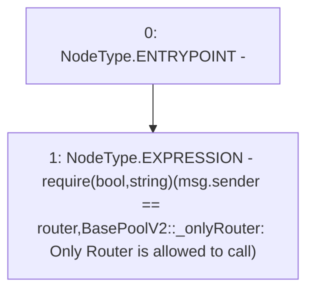

# Context: VaderPoolV2._onlyRouter

**Contract:** `VaderPoolV2` (Inherits: Ownable, BasePoolV2, ReentrancyGuard, ERC721, IERC721Metadata, IVaderPoolV2, IERC721, ERC165, IERC165, Context, GasThrottle, ProtocolConstants, IBasePoolV2)
**Signature:** `_onlyRouter()`
**Method Selector ID:** `Internal (No Method ID)`
**Visibility:** `private`
**Environment-Free:** `No (reads EVM state context)`
**Modifiers:** None

### State Variables Interaction
- **Reads:** router
- **Writes:** None

### Assertion Checks & Business Requirements
- require/assert: `require(bool,string)(msg.sender == router,BasePoolV2::_onlyRouter: Only Router is allowed to call)`

### Environment & Verification Flags
- **Uses Foundry Cheatcodes:** No
- **Has Echidna Properties:** No

### Internal Calls Tree
- None

### External Calls / Value Transfers
- None

### Control Flow Graph (CFG)


### Source Mapping
Declared in: `certora-ac-datasets/detasets/web3bugs/dataset/web3bugs/52/contracts/dex-v2/pool/BasePoolV2.sol` on lines **585** to **590**

```solidity
    function _onlyRouter() private view {
        require(
            msg.sender == router,
            "BasePoolV2::_onlyRouter: Only Router is allowed to call"
        );
    }

```
