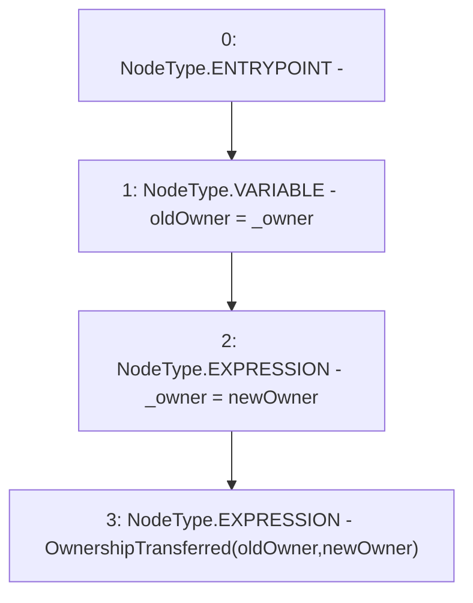

# Context: VaderPoolV2._transferOwnership

**Contract:** `VaderPoolV2` (Inherits: Ownable, BasePoolV2, ReentrancyGuard, ERC721, IERC721Metadata, IVaderPoolV2, IERC721, ERC165, IERC165, Context, GasThrottle, ProtocolConstants, IBasePoolV2)
**Signature:** `_transferOwnership(address)`
**Method Selector ID:** `Internal (No Method ID)`
**Visibility:** `internal`
**Environment-Free:** `Yes`
**Modifiers:** None

### State Variables Interaction
- **Reads:** _owner
- **Writes:** _owner

### Environment & Verification Flags
- **Uses Foundry Cheatcodes:** No
- **Has Echidna Properties:** No

### Internal Calls Tree
- None

### External Calls / Value Transfers
- None

### Control Flow Graph (CFG)


### Source Mapping
Declared in: `certora-ac-datasets/detasets/web3bugs/dataset/web3bugs/52/node_modules/@openzeppelin/contracts/access/Ownable.sol` on lines **78** to **82**

```solidity
    function _transferOwnership(address newOwner) internal virtual {
        address oldOwner = _owner;
        _owner = newOwner;
        emit OwnershipTransferred(oldOwner, newOwner);
    }

```
