# Context: VaderPoolV2.burnFungible

**Contract:** `VaderPoolV2` (Inherits: Ownable, BasePoolV2, ReentrancyGuard, ERC721, IERC721Metadata, IVaderPoolV2, IERC721, ERC165, IERC165, Context, GasThrottle, ProtocolConstants, IBasePoolV2)
**Signature:** `burnFungible(IERC20,uint256,address) returns (uint256, uint256)`
**Method Selector ID:** `0x6cda6ad6`
**Visibility:** `external`
**Environment-Free:** `No (reads EVM state context)`
**Modifiers:**
- `nonReentrant`
  ```solidity
  modifier nonReentrant() {
          _nonReentrantBefore();
          _;
          _nonReentrantAfter();
      }
  ```

### State Variables Interaction
- **Reads:** _ZERO_ADDRESS, nativeAsset, pairInfo, wrapper
- **Writes:** pairInfo

### Assertion Checks & Business Requirements
- require/assert: `require(bool,string)(lp != IERC20Extended(_ZERO_ADDRESS),VaderPoolV2::burnFungible: Unsupported Token)`
- require/assert: `require(bool,string)(amountNative > 0 && amountForeign > 0,VaderPoolV2::burnFungible: Insufficient Liquidity Burned)`

### Environment & Verification Flags
- **Uses Foundry Cheatcodes:** No
- **Has Echidna Properties:** No

### Internal Calls Tree
- None

### External Calls / Value Transfers
- `SafeERC20.LIBRARY_CALL, dest:SafeERC20, function:SafeERC20.safeTransfer(IERC20,address,uint256), arguments:['foreignAsset', 'to', 'amountForeign'] `
- `IERC20Extended.HIGH_LEVEL_CALL, dest:lp(IERC20Extended), function:burn, arguments:['liquidity']  `
- `SafeERC20.LIBRARY_CALL, dest:SafeERC20, function:SafeERC20.safeTransferFrom(IERC20,address,address,uint256), arguments:['TMP_1060', 'msg.sender', 'TMP_1061', 'liquidity'] `
- `ILPWrapper.TMP_1056(IERC20Extended) = HIGH_LEVEL_CALL, dest:wrapper(ILPWrapper), function:tokens, arguments:['foreignAsset']  `
- `SafeERC20.LIBRARY_CALL, dest:SafeERC20, function:SafeERC20.safeTransfer(IERC20,address,uint256), arguments:['nativeAsset', 'to', 'amountNative'] `

### Control Flow Graph (CFG)

```mermaid
flowchart TD
    Node_0["0: NodeType.ENTRYPOINT - "]
    Node_0 --> Node_18
    Node_1["1: NodeType.VARIABLE - lp = wrapper.tokens(foreignAsset)"]
    Node_1 --> Node_2
    Node_2["2: NodeType.EXPRESSION - require(bool,string)(lp != IERC20Extended(_ZERO_ADDRESS),VaderPoolV2::burnFungible: Unsupported Token)"]
    Node_2 --> Node_3
    Node_3["3: NodeType.EXPRESSION - IERC20(lp).safeTransferFrom(msg.sender,address(this),liquidity)"]
    Node_3 --> Node_4
    Node_4["4: NodeType.EXPRESSION - lp.burn(liquidity)"]
    Node_4 --> Node_5
    Node_5["5: NodeType.VARIABLE - "]
    Node_5 --> Node_6
    Node_6["6: NodeType.VARIABLE - "]
    Node_6 --> Node_7
    Node_7["7: NodeType.EXPRESSION - (reserveNative,reserveForeign,None) = getReserves(foreignAsset)"]
    Node_7 --> Node_8
    Node_8["8: NodeType.VARIABLE - pair = pairInfo(foreignAsset)"]
    Node_8 --> Node_9
    Node_9["9: NodeType.VARIABLE - _totalSupply = pair.totalSupply"]
    Node_9 --> Node_10
    Node_10["10: NodeType.EXPRESSION - amountNative = (liquidity * reserveNative) / _totalSupply"]
    Node_10 --> Node_11
    Node_11["11: NodeType.EXPRESSION - amountForeign = (liquidity * reserveForeign) / _totalSupply"]
    Node_11 --> Node_12
    Node_12["12: NodeType.EXPRESSION - require(bool,string)(amountNative > 0 && amountForeign > 0,VaderPoolV2::burnFungible: Insufficient Liquidity Burned)"]
    Node_12 --> Node_13
    Node_13["13: NodeType.EXPRESSION - pair.totalSupply = _totalSupply - liquidity"]
    Node_13 --> Node_14
    Node_14["14: NodeType.EXPRESSION - nativeAsset.safeTransfer(to,amountNative)"]
    Node_14 --> Node_15
    Node_15["15: NodeType.EXPRESSION - foreignAsset.safeTransfer(to,amountForeign)"]
    Node_15 --> Node_16
    Node_16["16: NodeType.EXPRESSION - _update(foreignAsset,reserveNative - amountNative,reserveForeign - amountForeign,reserveNative,reserveForeign)"]
    Node_16 --> Node_17
    Node_17["17: NodeType.EXPRESSION - Burn(msg.sender,amountNative,amountForeign,to)"]
    Node_17 --> Node_19
    Node_18["18: NodeType.EXPRESSION - nonReentrant()"]
    Node_18 --> Node_1
    Node_19["19: NodeType.RETURN - (amountNative,amountForeign)"]
```


### Source Mapping
Declared in: `certora-ac-datasets/detasets/web3bugs/dataset/web3bugs/52/contracts/dex-v2/pool/VaderPoolV2.sol` on lines **348** to **396**

```solidity
    function burnFungible(
        IERC20 foreignAsset,
        uint256 liquidity,
        address to
    )
        external
        override
        nonReentrant
        returns (uint256 amountNative, uint256 amountForeign)
    {
        IERC20Extended lp = wrapper.tokens(foreignAsset);

        require(
            lp != IERC20Extended(_ZERO_ADDRESS),
            "VaderPoolV2::burnFungible: Unsupported Token"
        );

        IERC20(lp).safeTransferFrom(msg.sender, address(this), liquidity);
        lp.burn(liquidity);

        (uint112 reserveNative, uint112 reserveForeign, ) = getReserves(
            foreignAsset
        ); // gas savings

        PairInfo storage pair = pairInfo[foreignAsset];
        uint256 _totalSupply = pair.totalSupply;
        amountNative = (liquidity * reserveNative) / _totalSupply;
        amountForeign = (liquidity * reserveForeign) / _totalSupply;

        require(
            amountNative > 0 && amountForeign > 0,
            "VaderPoolV2::burnFungible: Insufficient Liquidity Burned"
        );

        pair.totalSupply = _totalSupply - liquidity;

        nativeAsset.safeTransfer(to, amountNative);
        foreignAsset.safeTransfer(to, amountForeign);

        _update(
            foreignAsset,
            reserveNative - amountNative,
            reserveForeign - amountForeign,
            reserveNative,
            reserveForeign
        );

        emit Burn(msg.sender, amountNative, amountForeign, to);
    }

```
