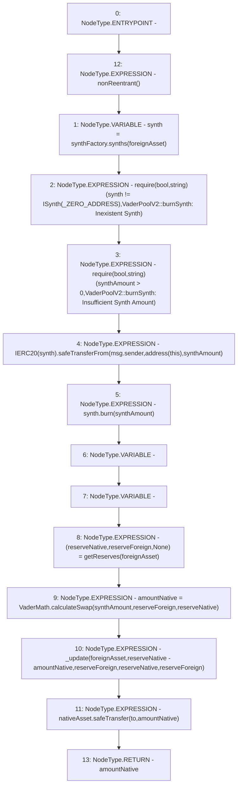

# Context: VaderPoolV2.burnSynth

**Contract:** `VaderPoolV2` (Inherits: Ownable, BasePoolV2, ReentrancyGuard, ERC721, IERC721Metadata, IVaderPoolV2, IERC721, ERC165, IERC165, Context, GasThrottle, ProtocolConstants, IBasePoolV2)
**Signature:** `burnSynth(IERC20,uint256,address) returns (uint256)`
**Method Selector ID:** `0x9e166470`
**Visibility:** `external`
**Environment-Free:** `No (reads EVM state context)`
**Modifiers:**
- `nonReentrant`
  ```solidity
  modifier nonReentrant() {
          _nonReentrantBefore();
          _;
          _nonReentrantAfter();
      }
  ```

### State Variables Interaction
- **Reads:** _ZERO_ADDRESS, nativeAsset, synthFactory
- **Writes:** None

### Assertion Checks & Business Requirements
- require/assert: `require(bool,string)(synth != ISynth(_ZERO_ADDRESS),VaderPoolV2::burnSynth: Inexistent Synth)`
- require/assert: `require(bool,string)(synthAmount > 0,VaderPoolV2::burnSynth: Insufficient Synth Amount)`

### Environment & Verification Flags
- **Uses Foundry Cheatcodes:** No
- **Has Echidna Properties:** No

### Internal Calls Tree
- None

### External Calls / Value Transfers
- `SafeERC20.LIBRARY_CALL, dest:SafeERC20, function:SafeERC20.safeTransferFrom(IERC20,address,address,uint256), arguments:['TMP_1022', 'msg.sender', 'TMP_1023', 'synthAmount'] `
- `ISynth.HIGH_LEVEL_CALL, dest:synth(ISynth), function:burn, arguments:['synthAmount']  `
- `VaderMath.TMP_1026(uint256) = LIBRARY_CALL, dest:VaderMath, function:VaderMath.calculateSwap(uint256,uint256,uint256), arguments:['synthAmount', 'reserveForeign', 'reserveNative'] `
- `ISynthFactory.TMP_1016(ISynth) = HIGH_LEVEL_CALL, dest:synthFactory(ISynthFactory), function:synths, arguments:['foreignAsset']  `
- `SafeERC20.LIBRARY_CALL, dest:SafeERC20, function:SafeERC20.safeTransfer(IERC20,address,uint256), arguments:['nativeAsset', 'to', 'amountNative'] `

### Control Flow Graph (CFG)


### Source Mapping
Declared in: `certora-ac-datasets/detasets/web3bugs/dataset/web3bugs/52/contracts/dex-v2/pool/VaderPoolV2.sol` on lines **179** to **219**

```solidity
    function burnSynth(
        IERC20 foreignAsset,
        uint256 synthAmount,
        address to
    ) external override nonReentrant returns (uint256 amountNative) {
        ISynth synth = synthFactory.synths(foreignAsset);

        require(
            synth != ISynth(_ZERO_ADDRESS),
            "VaderPoolV2::burnSynth: Inexistent Synth"
        );

        require(
            synthAmount > 0,
            "VaderPoolV2::burnSynth: Insufficient Synth Amount"
        );

        IERC20(synth).safeTransferFrom(msg.sender, address(this), synthAmount);
        synth.burn(synthAmount);

        (uint112 reserveNative, uint112 reserveForeign, ) = getReserves(
            foreignAsset
        ); // gas savings

        amountNative = VaderMath.calculateSwap(
            synthAmount,
            reserveForeign,
            reserveNative
        );

        // TODO: Clarify
        _update(
            foreignAsset,
            reserveNative - amountNative,
            reserveForeign,
            reserveNative,
            reserveForeign
        );

        nativeAsset.safeTransfer(to, amountNative);
    }

```
