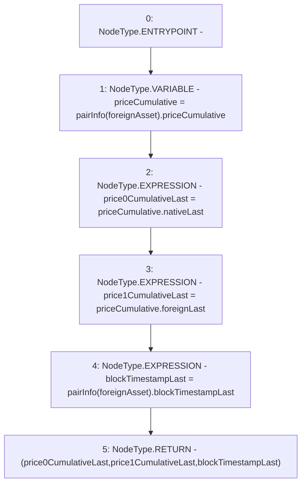

# Context: VaderPoolV2.cumulativePrices

**Contract:** `VaderPoolV2` (Inherits: Ownable, BasePoolV2, ReentrancyGuard, ERC721, IERC721Metadata, IVaderPoolV2, IERC721, ERC165, IERC165, Context, GasThrottle, ProtocolConstants, IBasePoolV2)
**Signature:** `cumulativePrices(IERC20) returns (uint256, uint256, uint32)`
**Method Selector ID:** `0x4e5ff248`
**Visibility:** `public`
**Environment-Free:** `Yes`
**Modifiers:** None

### State Variables Interaction
- **Reads:** pairInfo
- **Writes:** None

### Environment & Verification Flags
- **Uses Foundry Cheatcodes:** No
- **Has Echidna Properties:** No

### Internal Calls Tree
- None

### External Calls / Value Transfers
- None

### Control Flow Graph (CFG)


### Source Mapping
Declared in: `certora-ac-datasets/detasets/web3bugs/dataset/web3bugs/52/contracts/dex-v2/pool/VaderPoolV2.sol` on lines **62** to **76**

```solidity
    function cumulativePrices(IERC20 foreignAsset)
        public
        view
        returns (
            uint256 price0CumulativeLast,
            uint256 price1CumulativeLast,
            uint32 blockTimestampLast
        )
    {
        PriceCumulative memory priceCumulative = pairInfo[foreignAsset]
            .priceCumulative;
        price0CumulativeLast = priceCumulative.nativeLast;
        price1CumulativeLast = priceCumulative.foreignLast;
        blockTimestampLast = pairInfo[foreignAsset].blockTimestampLast;
    }

```
