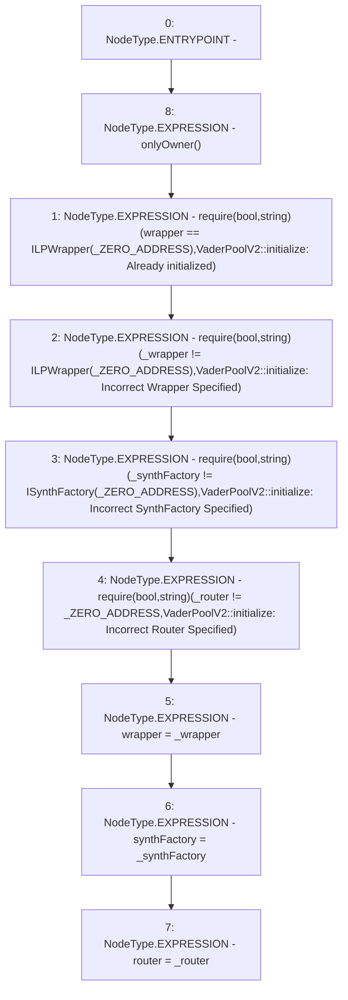

# Context: VaderPoolV2.initialize

**Contract:** `VaderPoolV2` (Inherits: Ownable, BasePoolV2, ReentrancyGuard, ERC721, IERC721Metadata, IVaderPoolV2, IERC721, ERC165, IERC165, Context, GasThrottle, ProtocolConstants, IBasePoolV2)
**Signature:** `initialize(ILPWrapper,ISynthFactory,address)`
**Method Selector ID:** `0xc0c53b8b`
**Visibility:** `external`
**Environment-Free:** `No (reads EVM state context)`
**Modifiers:**
- `onlyOwner`
  ```solidity
  modifier onlyOwner() {
          _checkOwner();
          _;
      }
  ```

### State Variables Interaction
- **Reads:** _ZERO_ADDRESS, wrapper
- **Writes:** router, synthFactory, wrapper

### Assertion Checks & Business Requirements
- require/assert: `require(bool,string)(wrapper == ILPWrapper(_ZERO_ADDRESS),VaderPoolV2::initialize: Already initialized)`
- require/assert: `require(bool,string)(_wrapper != ILPWrapper(_ZERO_ADDRESS),VaderPoolV2::initialize: Incorrect Wrapper Specified)`
- require/assert: `require(bool,string)(_synthFactory != ISynthFactory(_ZERO_ADDRESS),VaderPoolV2::initialize: Incorrect SynthFactory Specified)`
- require/assert: `require(bool,string)(_router != _ZERO_ADDRESS,VaderPoolV2::initialize: Incorrect Router Specified)`

### Environment & Verification Flags
- **Uses Foundry Cheatcodes:** No
- **Has Echidna Properties:** No

### Internal Calls Tree
- None

### External Calls / Value Transfers
- None

### Control Flow Graph (CFG)


### Source Mapping
Declared in: `certora-ac-datasets/detasets/web3bugs/dataset/web3bugs/52/contracts/dex-v2/pool/VaderPoolV2.sol` on lines **89** to **113**

```solidity
    function initialize(
        ILPWrapper _wrapper,
        ISynthFactory _synthFactory,
        address _router
    ) external onlyOwner {
        require(
            wrapper == ILPWrapper(_ZERO_ADDRESS),
            "VaderPoolV2::initialize: Already initialized"
        );
        require(
            _wrapper != ILPWrapper(_ZERO_ADDRESS),
            "VaderPoolV2::initialize: Incorrect Wrapper Specified"
        );
        require(
            _synthFactory != ISynthFactory(_ZERO_ADDRESS),
            "VaderPoolV2::initialize: Incorrect SynthFactory Specified"
        );
        require(
            _router != _ZERO_ADDRESS,
            "VaderPoolV2::initialize: Incorrect Router Specified"
        );
        wrapper = _wrapper;
        synthFactory = _synthFactory;
        router = _router;
    }

```
