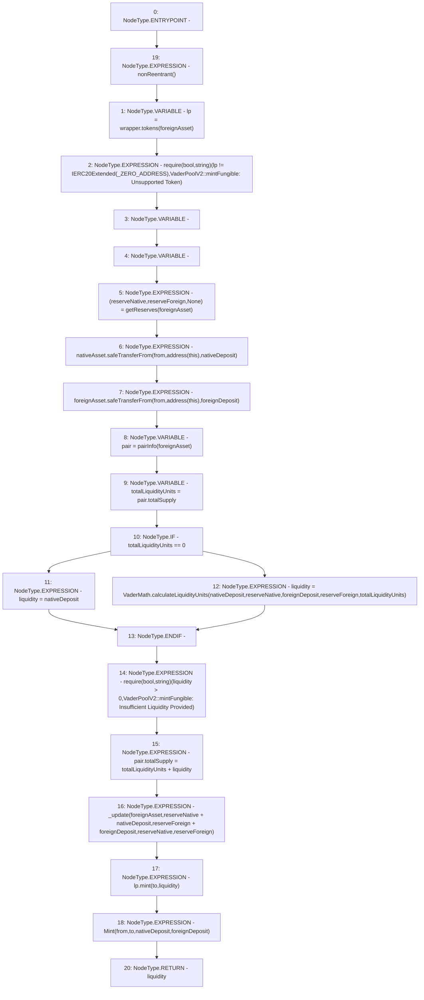

# Context: VaderPoolV2.mintFungible

**Contract:** `VaderPoolV2` (Inherits: Ownable, BasePoolV2, ReentrancyGuard, ERC721, IERC721Metadata, IVaderPoolV2, IERC721, ERC165, IERC165, Context, GasThrottle, ProtocolConstants, IBasePoolV2)
**Signature:** `mintFungible(IERC20,uint256,uint256,address,address) returns (uint256)`
**Method Selector ID:** `0xb41b23b7`
**Visibility:** `external`
**Environment-Free:** `No (reads EVM state context)`
**Modifiers:**
- `nonReentrant`
  ```solidity
  modifier nonReentrant() {
          _nonReentrantBefore();
          _;
          _nonReentrantAfter();
      }
  ```

### State Variables Interaction
- **Reads:** _ZERO_ADDRESS, nativeAsset, pairInfo, wrapper
- **Writes:** pairInfo

### Assertion Checks & Business Requirements
- require/assert: `require(bool,string)(lp != IERC20Extended(_ZERO_ADDRESS),VaderPoolV2::mintFungible: Unsupported Token)`
- require/assert: `require(bool,string)(liquidity > 0,VaderPoolV2::mintFungible: Insufficient Liquidity Provided)`

### Environment & Verification Flags
- **Uses Foundry Cheatcodes:** No
- **Has Echidna Properties:** No

### Internal Calls Tree
- None

### External Calls / Value Transfers
- `IERC20Extended.HIGH_LEVEL_CALL, dest:lp(IERC20Extended), function:mint, arguments:['to', 'liquidity']  `
- `VaderMath.TMP_1046(uint256) = LIBRARY_CALL, dest:VaderMath, function:VaderMath.calculateLiquidityUnits(uint256,uint256,uint256,uint256,uint256), arguments:['nativeDeposit', 'reserveNative', 'foreignDeposit', 'reserveForeign', 'totalLiquidityUnits'] `
- `SafeERC20.LIBRARY_CALL, dest:SafeERC20, function:SafeERC20.safeTransferFrom(IERC20,address,address,uint256), arguments:['foreignAsset', 'from', 'TMP_1043', 'foreignDeposit'] `
- `ILPWrapper.TMP_1037(IERC20Extended) = HIGH_LEVEL_CALL, dest:wrapper(ILPWrapper), function:tokens, arguments:['foreignAsset']  `
- `SafeERC20.LIBRARY_CALL, dest:SafeERC20, function:SafeERC20.safeTransferFrom(IERC20,address,address,uint256), arguments:['nativeAsset', 'from', 'TMP_1041', 'nativeDeposit'] `

### Control Flow Graph (CFG)


### Source Mapping
Declared in: `certora-ac-datasets/detasets/web3bugs/dataset/web3bugs/52/contracts/dex-v2/pool/VaderPoolV2.sol` on lines **284** to **335**

```solidity
    function mintFungible(
        IERC20 foreignAsset,
        uint256 nativeDeposit,
        uint256 foreignDeposit,
        address from,
        address to
    ) external override nonReentrant returns (uint256 liquidity) {
        IERC20Extended lp = wrapper.tokens(foreignAsset);

        require(
            lp != IERC20Extended(_ZERO_ADDRESS),
            "VaderPoolV2::mintFungible: Unsupported Token"
        );

        (uint112 reserveNative, uint112 reserveForeign, ) = getReserves(
            foreignAsset
        ); // gas savings

        nativeAsset.safeTransferFrom(from, address(this), nativeDeposit);
        foreignAsset.safeTransferFrom(from, address(this), foreignDeposit);

        PairInfo storage pair = pairInfo[foreignAsset];
        uint256 totalLiquidityUnits = pair.totalSupply;
        if (totalLiquidityUnits == 0) liquidity = nativeDeposit;
        else
            liquidity = VaderMath.calculateLiquidityUnits(
                nativeDeposit,
                reserveNative,
                foreignDeposit,
                reserveForeign,
                totalLiquidityUnits
            );

        require(
            liquidity > 0,
            "VaderPoolV2::mintFungible: Insufficient Liquidity Provided"
        );

        pair.totalSupply = totalLiquidityUnits + liquidity;

        _update(
            foreignAsset,
            reserveNative + nativeDeposit,
            reserveForeign + foreignDeposit,
            reserveNative,
            reserveForeign
        );

        lp.mint(to, liquidity);

        emit Mint(from, to, nativeDeposit, foreignDeposit);
    }

```
