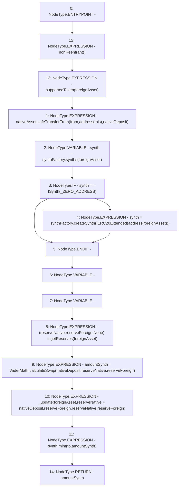

# Context: VaderPoolV2.mintSynth

**Contract:** `VaderPoolV2` (Inherits: Ownable, BasePoolV2, ReentrancyGuard, ERC721, IERC721Metadata, IVaderPoolV2, IERC721, ERC165, IERC165, Context, GasThrottle, ProtocolConstants, IBasePoolV2)
**Signature:** `mintSynth(IERC20,uint256,address,address) returns (uint256)`
**Method Selector ID:** `0x8628276f`
**Visibility:** `external`
**Environment-Free:** `No (reads EVM state context)`
**Modifiers:**
- `nonReentrant`
  ```solidity
  modifier nonReentrant() {
          _nonReentrantBefore();
          _;
          _nonReentrantAfter();
      }
  ```
- `supportedToken`
  ```solidity
  modifier supportedToken(IERC20 token) {
          _supportedToken(token);
          _;
      }
  ```

### State Variables Interaction
- **Reads:** _ZERO_ADDRESS, nativeAsset, synthFactory
- **Writes:** None

### Environment & Verification Flags
- **Uses Foundry Cheatcodes:** No
- **Has Echidna Properties:** No

### Internal Calls Tree
- None

### External Calls / Value Transfers
- `VaderMath.TMP_1010(uint256) = LIBRARY_CALL, dest:VaderMath, function:VaderMath.calculateSwap(uint256,uint256,uint256), arguments:['nativeDeposit', 'reserveNative', 'reserveForeign'] `
- `ISynthFactory.TMP_1004(ISynth) = HIGH_LEVEL_CALL, dest:synthFactory(ISynthFactory), function:synths, arguments:['foreignAsset']  `
- `ISynthFactory.TMP_1009(ISynth) = HIGH_LEVEL_CALL, dest:synthFactory(ISynthFactory), function:createSynth, arguments:['TMP_1008']  `
- `ISynth.HIGH_LEVEL_CALL, dest:synth(ISynth), function:mint, arguments:['to', 'amountSynth']  `
- `SafeERC20.LIBRARY_CALL, dest:SafeERC20, function:SafeERC20.safeTransferFrom(IERC20,address,address,uint256), arguments:['nativeAsset', 'from', 'TMP_1002', 'nativeDeposit'] `

### Control Flow Graph (CFG)


### Source Mapping
Declared in: `certora-ac-datasets/detasets/web3bugs/dataset/web3bugs/52/contracts/dex-v2/pool/VaderPoolV2.sol` on lines **126** to **167**

```solidity
    function mintSynth(
        IERC20 foreignAsset,
        uint256 nativeDeposit,
        address from,
        address to
    )
        external
        override
        nonReentrant
        supportedToken(foreignAsset)
        returns (uint256 amountSynth)
    {
        nativeAsset.safeTransferFrom(from, address(this), nativeDeposit);

        ISynth synth = synthFactory.synths(foreignAsset);

        if (synth == ISynth(_ZERO_ADDRESS))
            synth = synthFactory.createSynth(
                IERC20Extended(address(foreignAsset))
            );

        (uint112 reserveNative, uint112 reserveForeign, ) = getReserves(
            foreignAsset
        ); // gas savings

        amountSynth = VaderMath.calculateSwap(
            nativeDeposit,
            reserveNative,
            reserveForeign
        );

        // TODO: Clarify
        _update(
            foreignAsset,
            reserveNative + nativeDeposit,
            reserveForeign,
            reserveNative,
            reserveForeign
        );

        synth.mint(to, amountSynth);
    }

```
