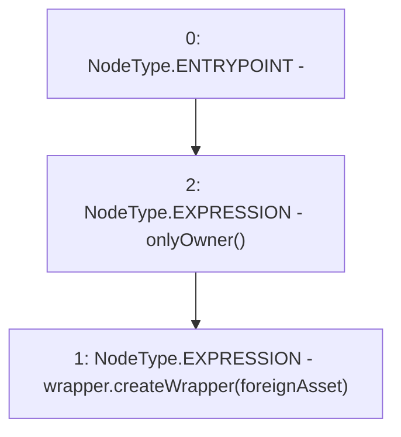

# Context: VaderPoolV2.setFungibleTokenSupport

**Contract:** `VaderPoolV2` (Inherits: Ownable, BasePoolV2, ReentrancyGuard, ERC721, IERC721Metadata, IVaderPoolV2, IERC721, ERC165, IERC165, Context, GasThrottle, ProtocolConstants, IBasePoolV2)
**Signature:** `setFungibleTokenSupport(IERC20)`
**Method Selector ID:** `0x7f0e5385`
**Visibility:** `external`
**Environment-Free:** `No (reads EVM state context)`
**Modifiers:**
- `onlyOwner`
  ```solidity
  modifier onlyOwner() {
          _checkOwner();
          _;
      }
  ```

### State Variables Interaction
- **Reads:** wrapper
- **Writes:** None

### Environment & Verification Flags
- **Uses Foundry Cheatcodes:** No
- **Has Echidna Properties:** No

### Internal Calls Tree
- None

### External Calls / Value Transfers
- `ILPWrapper.HIGH_LEVEL_CALL, dest:wrapper(ILPWrapper), function:createWrapper, arguments:['foreignAsset']  `

### Control Flow Graph (CFG)


### Source Mapping
Declared in: `certora-ac-datasets/detasets/web3bugs/dataset/web3bugs/52/contracts/dex-v2/pool/VaderPoolV2.sol` on lines **431** to **437**

```solidity
    function setFungibleTokenSupport(IERC20 foreignAsset)
        external
        override
        onlyOwner
    {
        wrapper.createWrapper(foreignAsset);
    }

```
