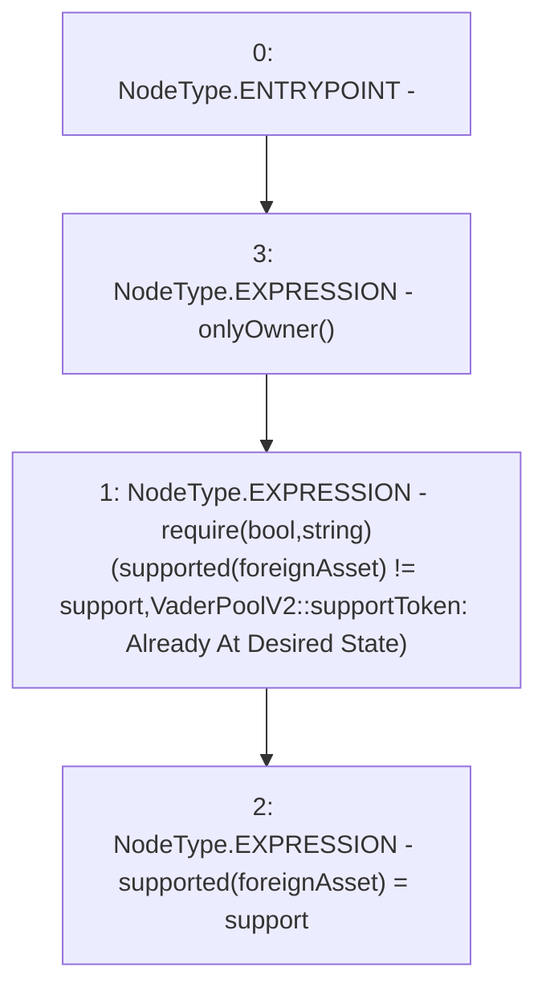

# Context: VaderPoolV2.setTokenSupport

**Contract:** `VaderPoolV2` (Inherits: Ownable, BasePoolV2, ReentrancyGuard, ERC721, IERC721Metadata, IVaderPoolV2, IERC721, ERC165, IERC165, Context, GasThrottle, ProtocolConstants, IBasePoolV2)
**Signature:** `setTokenSupport(IERC20,bool)`
**Method Selector ID:** `0x0c6a753f`
**Visibility:** `external`
**Environment-Free:** `No (reads EVM state context)`
**Modifiers:**
- `onlyOwner`
  ```solidity
  modifier onlyOwner() {
          _checkOwner();
          _;
      }
  ```

### State Variables Interaction
- **Reads:** supported
- **Writes:** supported

### Assertion Checks & Business Requirements
- require/assert: `require(bool,string)(supported[foreignAsset] != support,VaderPoolV2::supportToken: Already At Desired State)`

### Environment & Verification Flags
- **Uses Foundry Cheatcodes:** No
- **Has Echidna Properties:** No

### Internal Calls Tree
- None

### External Calls / Value Transfers
- None

### Control Flow Graph (CFG)


### Source Mapping
Declared in: `certora-ac-datasets/detasets/web3bugs/dataset/web3bugs/52/contracts/dex-v2/pool/VaderPoolV2.sol` on lines **413** to **423**

```solidity
    function setTokenSupport(IERC20 foreignAsset, bool support)
        external
        override
        onlyOwner
    {
        require(
            supported[foreignAsset] != support,
            "VaderPoolV2::supportToken: Already At Desired State"
        );
        supported[foreignAsset] = support;
    }

```
