# Context: VaderPool._burn

**Contract:** `VaderPool` (Inherits: BasePool, ReentrancyGuard, Ownable, ERC721, IERC721Metadata, IVaderPool, IERC721, ERC165, IERC165, Context, GasThrottle, ProtocolConstants, IBasePool)
**Signature:** `_burn(uint256,address) returns (uint256, uint256)`
**Method Selector ID:** `Internal (No Method ID)`
**Visibility:** `internal`
**Environment-Free:** `No (reads EVM state context)`
**Modifiers:**
- `nonReentrant`
  ```solidity
  modifier nonReentrant() {
          _nonReentrantBefore();
          _;
          _nonReentrantAfter();
      }
  ```

### State Variables Interaction
- **Reads:** foreignAsset, nativeAsset, positions, totalSupply
- **Writes:** totalSupply

### Assertion Checks & Business Requirements
- require/assert: `require(bool,string)(ownerOf(id) == address(this),BasePool::burn: Incorrect Ownership)`
- require/assert: `require(bool,string)(amountNative > 0 && amountForeign > 0,BasePool::burn: Insufficient Liquidity Burned)`

### Environment & Verification Flags
- **Uses Foundry Cheatcodes:** No
- **Has Echidna Properties:** No

### Internal Calls Tree
- None

### External Calls / Value Transfers
- `SafeERC20.LIBRARY_CALL, dest:SafeERC20, function:SafeERC20.safeTransfer(IERC20,address,uint256), arguments:['_foreignAsset', 'to', 'amountForeign'] `
- `IERC20.TMP_806(uint256) = HIGH_LEVEL_CALL, dest:_foreignAsset(IERC20), function:balanceOf, arguments:['TMP_805']  `
- `IERC20.TMP_791(uint256) = HIGH_LEVEL_CALL, dest:TMP_789(IERC20), function:balanceOf, arguments:['TMP_790']  `
- `IERC20.TMP_788(uint256) = HIGH_LEVEL_CALL, dest:TMP_786(IERC20), function:balanceOf, arguments:['TMP_787']  `
- `IERC20.TMP_804(uint256) = HIGH_LEVEL_CALL, dest:_nativeAsset(IERC20), function:balanceOf, arguments:['TMP_803']  `
- `SafeERC20.LIBRARY_CALL, dest:SafeERC20, function:SafeERC20.safeTransfer(IERC20,address,uint256), arguments:['_nativeAsset', 'to', 'amountNative'] `

### Control Flow Graph (CFG)

```mermaid
flowchart TD
    Node_0["0: NodeType.ENTRYPOINT - "]
    Node_0 --> Node_22
    Node_1["1: NodeType.EXPRESSION - require(bool,string)(ownerOf(id) == address(this),BasePool::burn: Incorrect Ownership)"]
    Node_1 --> Node_2
    Node_2["2: NodeType.VARIABLE - "]
    Node_2 --> Node_3
    Node_3["3: NodeType.VARIABLE - "]
    Node_3 --> Node_4
    Node_4["4: NodeType.EXPRESSION - (reserveNative,reserveForeign,None) = getReserves()"]
    Node_4 --> Node_5
    Node_5["5: NodeType.VARIABLE - _nativeAsset = nativeAsset"]
    Node_5 --> Node_6
    Node_6["6: NodeType.VARIABLE - _foreignAsset = foreignAsset"]
    Node_6 --> Node_7
    Node_7["7: NodeType.VARIABLE - nativeBalance = IERC20(_nativeAsset).balanceOf(address(this))"]
    Node_7 --> Node_8
    Node_8["8: NodeType.VARIABLE - foreignBalance = IERC20(_foreignAsset).balanceOf(address(this))"]
    Node_8 --> Node_9
    Node_9["9: NodeType.VARIABLE - liquidity = positions(id).liquidity"]
    Node_9 --> Node_10
    Node_10["10: NodeType.VARIABLE - _totalSupply = totalSupply"]
    Node_10 --> Node_11
    Node_11["11: NodeType.EXPRESSION - amountNative = (liquidity * nativeBalance) / _totalSupply"]
    Node_11 --> Node_12
    Node_12["12: NodeType.EXPRESSION - amountForeign = (liquidity * foreignBalance) / _totalSupply"]
    Node_12 --> Node_13
    Node_13["13: NodeType.EXPRESSION - require(bool,string)(amountNative > 0 && amountForeign > 0,BasePool::burn: Insufficient Liquidity Burned)"]
    Node_13 --> Node_14
    Node_14["14: NodeType.EXPRESSION - totalSupply -= liquidity"]
    Node_14 --> Node_15
    Node_15["15: NodeType.EXPRESSION - _burn(id)"]
    Node_15 --> Node_16
    Node_16["16: NodeType.EXPRESSION - _nativeAsset.safeTransfer(to,amountNative)"]
    Node_16 --> Node_17
    Node_17["17: NodeType.EXPRESSION - _foreignAsset.safeTransfer(to,amountForeign)"]
    Node_17 --> Node_18
    Node_18["18: NodeType.EXPRESSION - nativeBalance = _nativeAsset.balanceOf(address(this))"]
    Node_18 --> Node_19
    Node_19["19: NodeType.EXPRESSION - foreignBalance = _foreignAsset.balanceOf(address(this))"]
    Node_19 --> Node_20
    Node_20["20: NodeType.EXPRESSION - _update(nativeBalance,foreignBalance,reserveNative,reserveForeign)"]
    Node_20 --> Node_21
    Node_21["21: NodeType.EXPRESSION - Burn(msg.sender,amountNative,amountForeign,to)"]
    Node_21 --> Node_23
    Node_22["22: NodeType.EXPRESSION - nonReentrant()"]
    Node_22 --> Node_1
    Node_23["23: NodeType.RETURN - (amountNative,amountForeign)"]
```


### Source Mapping
Declared in: `certora-ac-datasets/detasets/web3bugs/dataset/web3bugs/52/contracts/dex/pool/BasePool.sol` on lines **214** to **253**

```solidity
    function _burn(uint256 id, address to)
        internal
        nonReentrant
        returns (uint256 amountNative, uint256 amountForeign)
    {
        require(
            ownerOf(id) == address(this),
            "BasePool::burn: Incorrect Ownership"
        );

        (uint112 reserveNative, uint112 reserveForeign, ) = getReserves(); // gas savings
        IERC20 _nativeAsset = nativeAsset; // gas savings
        IERC20 _foreignAsset = foreignAsset; // gas savings
        uint256 nativeBalance = IERC20(_nativeAsset).balanceOf(address(this));
        uint256 foreignBalance = IERC20(_foreignAsset).balanceOf(address(this));

        uint256 liquidity = positions[id].liquidity;

        uint256 _totalSupply = totalSupply; // gas savings, must be defined here since totalSupply can update in _mintFee
        amountNative = (liquidity * nativeBalance) / _totalSupply; // using balances ensures pro-rata distribution
        amountForeign = (liquidity * foreignBalance) / _totalSupply; // using balances ensures pro-rata distribution

        require(
            amountNative > 0 && amountForeign > 0,
            "BasePool::burn: Insufficient Liquidity Burned"
        );

        totalSupply -= liquidity;
        _burn(id);

        _nativeAsset.safeTransfer(to, amountNative);
        _foreignAsset.safeTransfer(to, amountForeign);

        nativeBalance = _nativeAsset.balanceOf(address(this));
        foreignBalance = _foreignAsset.balanceOf(address(this));

        _update(nativeBalance, foreignBalance, reserveNative, reserveForeign);

        emit Burn(msg.sender, amountNative, amountForeign, to);
    }

```
