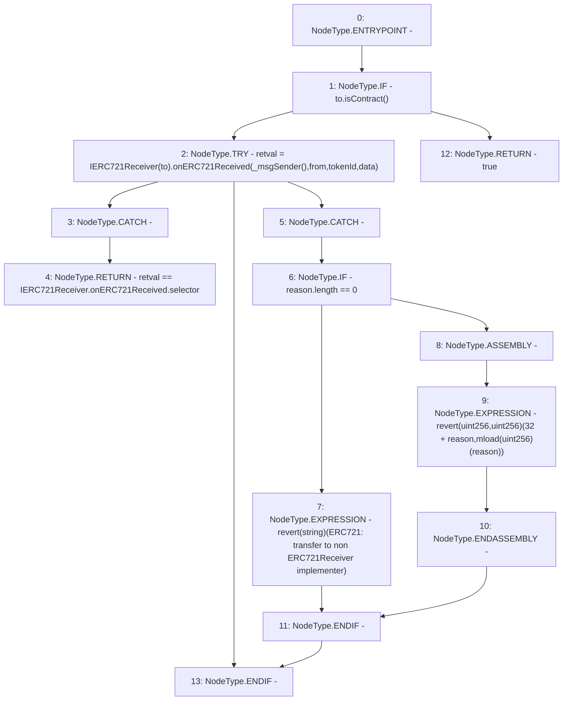

# Context: VaderPool._checkOnERC721Received

**Contract:** `VaderPool` (Inherits: BasePool, ReentrancyGuard, Ownable, ERC721, IERC721Metadata, IVaderPool, IERC721, ERC165, IERC165, Context, GasThrottle, ProtocolConstants, IBasePool)
**Signature:** `_checkOnERC721Received(address,address,uint256,bytes) returns (bool)`
**Method Selector ID:** `Internal (No Method ID)`
**Visibility:** `private`
**Environment-Free:** `No (reads EVM state context)`
**Modifiers:** None

### State Variables Interaction
- **Reads:** None
- **Writes:** None

### Assertion Checks & Business Requirements
- revert: `revert(string)(ERC721: transfer to non ERC721Receiver implementer)`
- revert: `revert(uint256,uint256)(32 + reason,mload(uint256)(reason))`

### Environment & Verification Flags
- **Uses Foundry Cheatcodes:** No
- **Has Echidna Properties:** No

### Internal Calls Tree
- None

### External Calls / Value Transfers
- `IERC721Receiver.TMP_1013(bytes4) = HIGH_LEVEL_CALL, dest:TMP_1011(IERC721Receiver), function:onERC721Received, arguments:['TMP_1012', 'from', 'tokenId', 'data']  `
- `Address.TMP_1010(bool) = LIBRARY_CALL, dest:Address, function:Address.isContract(address), arguments:['to'] `
- `TMP_1016(None) = SOLIDITY_CALL revert(string)(ERC721: transfer to non ERC721Receiver implementer)`

### Control Flow Graph (CFG)


### Source Mapping
Declared in: `certora-ac-datasets/detasets/web3bugs/dataset/web3bugs/52/node_modules/@openzeppelin/contracts/token/ERC721/ERC721.sol` on lines **399** to **421**

```solidity
    function _checkOnERC721Received(
        address from,
        address to,
        uint256 tokenId,
        bytes memory data
    ) private returns (bool) {
        if (to.isContract()) {
            try IERC721Receiver(to).onERC721Received(_msgSender(), from, tokenId, data) returns (bytes4 retval) {
                return retval == IERC721Receiver.onERC721Received.selector;
            } catch (bytes memory reason) {
                if (reason.length == 0) {
                    revert("ERC721: transfer to non ERC721Receiver implementer");
                } else {
                    /// @solidity memory-safe-assembly
                    assembly {
                        revert(add(32, reason), mload(reason))
                    }
                }
            }
        } else {
            return true;
        }
    }

```
