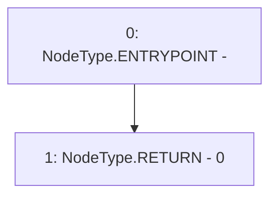

# Context: VaderPool._contextSuffixLength

**Contract:** `VaderPool` (Inherits: BasePool, ReentrancyGuard, Ownable, ERC721, IERC721Metadata, IVaderPool, IERC721, ERC165, IERC165, Context, GasThrottle, ProtocolConstants, IBasePool)
**Signature:** `_contextSuffixLength() returns (uint256)`
**Method Selector ID:** `Internal (No Method ID)`
**Visibility:** `internal`
**Environment-Free:** `Yes`
**Modifiers:** None

### State Variables Interaction
- **Reads:** None
- **Writes:** None

### Environment & Verification Flags
- **Uses Foundry Cheatcodes:** No
- **Has Echidna Properties:** No

### Internal Calls Tree
- None

### External Calls / Value Transfers
- None

### Control Flow Graph (CFG)


### Source Mapping
Declared in: `certora-ac-datasets/detasets/web3bugs/dataset/web3bugs/52/node_modules/@openzeppelin/contracts/utils/Context.sol` on lines **25** to **27**

```solidity
    function _contextSuffixLength() internal view virtual returns (uint256) {
        return 0;
    }

```
