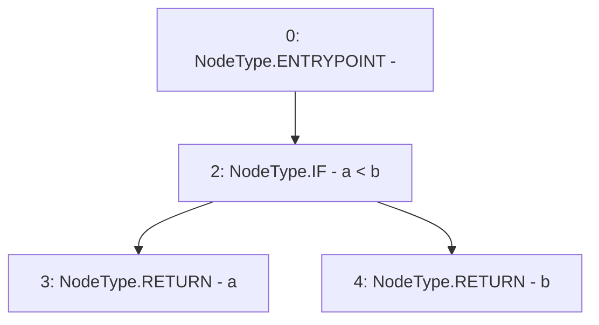

# Context: VaderPool._min

**Contract:** `VaderPool` (Inherits: BasePool, ReentrancyGuard, Ownable, ERC721, IERC721Metadata, IVaderPool, IERC721, ERC165, IERC165, Context, GasThrottle, ProtocolConstants, IBasePool)
**Signature:** `_min(uint256,uint256) returns (uint256)`
**Method Selector ID:** `Internal (No Method ID)`
**Visibility:** `private`
**Environment-Free:** `Yes`
**Modifiers:** None

### State Variables Interaction
- **Reads:** None
- **Writes:** None

### Environment & Verification Flags
- **Uses Foundry Cheatcodes:** No
- **Has Echidna Properties:** No

### Internal Calls Tree
- None

### External Calls / Value Transfers
- None

### Control Flow Graph (CFG)


### Source Mapping
Declared in: `certora-ac-datasets/detasets/web3bugs/dataset/web3bugs/52/contracts/dex/pool/VaderPool.sol` on lines **118** to **120**

```solidity
    function _min(uint256 a, uint256 b) private pure returns (uint256) {
        return a < b ? a : b;
    }

```
