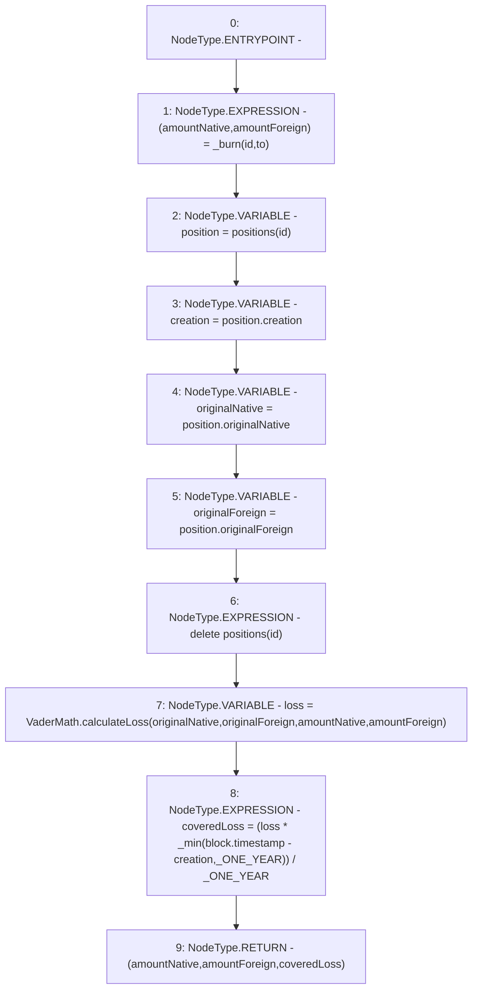

# Context: VaderPool.burn

**Contract:** `VaderPool` (Inherits: BasePool, ReentrancyGuard, Ownable, ERC721, IERC721Metadata, IVaderPool, IERC721, ERC165, IERC165, Context, GasThrottle, ProtocolConstants, IBasePool)
**Signature:** `burn(uint256,address) returns (uint256, uint256, uint256)`
**Method Selector ID:** `0xfcd3533c`
**Visibility:** `external`
**Environment-Free:** `No (reads EVM state context)`
**Modifiers:** None

### State Variables Interaction
- **Reads:** _ONE_YEAR, positions
- **Writes:** positions

### Environment & Verification Flags
- **Uses Foundry Cheatcodes:** No
- **Has Echidna Properties:** No

### Internal Calls Tree
- None

### External Calls / Value Transfers
- `VaderMath.TMP_1023(uint256) = LIBRARY_CALL, dest:VaderMath, function:VaderMath.calculateLoss(uint256,uint256,uint256,uint256), arguments:['originalNative', 'originalForeign', 'amountNative', 'amountForeign'] `

### Control Flow Graph (CFG)


### Source Mapping
Declared in: `certora-ac-datasets/detasets/web3bugs/dataset/web3bugs/52/contracts/dex/pool/VaderPool.sol` on lines **58** to **89**

```solidity
    function burn(uint256 id, address to)
        external
        override
        returns (
            uint256 amountNative,
            uint256 amountForeign,
            uint256 coveredLoss
        )
    {
        (amountNative, amountForeign) = _burn(id, to);

        Position storage position = positions[id];

        uint256 creation = position.creation;
        uint256 originalNative = position.originalNative;
        uint256 originalForeign = position.originalForeign;

        delete positions[id];

        // NOTE: Validate it behaves as expected for non-18 decimal tokens
        uint256 loss = VaderMath.calculateLoss(
            originalNative,
            originalForeign,
            amountNative,
            amountForeign
        );

        // TODO: Original Implementation Applied 100 Days
        coveredLoss =
            (loss * _min(block.timestamp - creation, _ONE_YEAR)) /
            _ONE_YEAR;
    }

```
