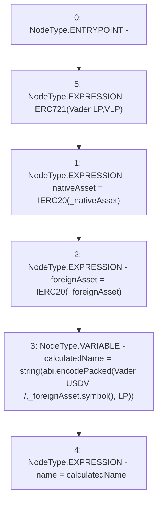

# Context: VaderPool.constructor

**Contract:** `VaderPool` (Inherits: BasePool, ReentrancyGuard, Ownable, ERC721, IERC721Metadata, IVaderPool, IERC721, ERC165, IERC165, Context, GasThrottle, ProtocolConstants, IBasePool)
**Signature:** `constructor(IERC20Extended,IERC20Extended)`
**Method Selector ID:** `0x4525f804`
**Visibility:** `public`
**Environment-Free:** `Yes`
**Modifiers:** None

### State Variables Interaction
- **Reads:** None
- **Writes:** _name, foreignAsset, nativeAsset

### Environment & Verification Flags
- **Uses Foundry Cheatcodes:** No
- **Has Echidna Properties:** No

### Internal Calls Tree
- None

### External Calls / Value Transfers
- `IERC20Extended.TMP_761(string) = HIGH_LEVEL_CALL, dest:_foreignAsset(IERC20Extended), function:symbol, arguments:[]  `

### Control Flow Graph (CFG)


### Source Mapping
Declared in: `certora-ac-datasets/detasets/web3bugs/dataset/web3bugs/52/contracts/dex/pool/BasePool.sol` on lines **94** to **104**

```solidity
    constructor(IERC20Extended _nativeAsset, IERC20Extended _foreignAsset)
        ERC721("Vader LP", "VLP")
    {
        nativeAsset = IERC20(_nativeAsset);
        foreignAsset = IERC20(_foreignAsset);

        string memory calculatedName = string(
            abi.encodePacked("Vader USDV /", _foreignAsset.symbol(), " LP")
        );
        _name = calculatedName;
    }

```
