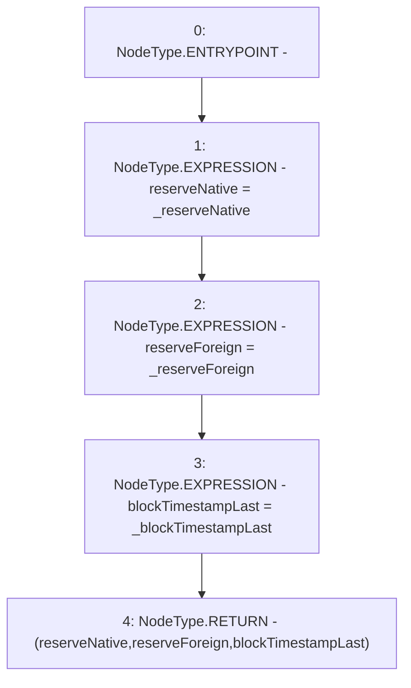

# Context: VaderPool.getReserves

**Contract:** `VaderPool` (Inherits: BasePool, ReentrancyGuard, Ownable, ERC721, IERC721Metadata, IVaderPool, IERC721, ERC165, IERC165, Context, GasThrottle, ProtocolConstants, IBasePool)
**Signature:** `getReserves() returns (uint112, uint112, uint32)`
**Method Selector ID:** `0x0902f1ac`
**Visibility:** `public`
**Environment-Free:** `Yes`
**Modifiers:** None

### State Variables Interaction
- **Reads:** _blockTimestampLast, _reserveForeign, _reserveNative
- **Writes:** None

### Environment & Verification Flags
- **Uses Foundry Cheatcodes:** No
- **Has Echidna Properties:** No

### Internal Calls Tree
- None

### External Calls / Value Transfers
- None

### Control Flow Graph (CFG)


### Source Mapping
Declared in: `certora-ac-datasets/detasets/web3bugs/dataset/web3bugs/52/contracts/dex/pool/BasePool.sol` on lines **112** to **124**

```solidity
    function getReserves()
        public
        view
        returns (
            uint112 reserveNative,
            uint112 reserveForeign,
            uint32 blockTimestampLast
        )
    {
        reserveNative = _reserveNative;
        reserveForeign = _reserveForeign;
        blockTimestampLast = _blockTimestampLast;
    }

```
