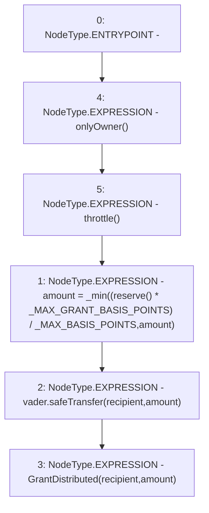

# Context: VaderReserve.grant

**Contract:** `VaderReserve` (Inherits: Ownable, Context, ProtocolConstants, IVaderReserve)
**Signature:** `grant(address,uint256)`
**Method Selector ID:** `0x6370920e`
**Visibility:** `external`
**Environment-Free:** `No (reads EVM state context)`
**Modifiers:**
- `onlyOwner`
  ```solidity
  modifier onlyOwner() {
          _checkOwner();
          _;
      }
  ```
- `throttle`
  ```solidity
  modifier throttle() {
          require(
              lastGrant + _GRANT_DELAY <= block.timestamp,
              "VaderReserve::throttle: Grant Too Fast"
          );
          lastGrant = block.timestamp;
          _;
      }
  ```

### State Variables Interaction
- **Reads:** _MAX_BASIS_POINTS, _MAX_GRANT_BASIS_POINTS, vader
- **Writes:** None

### Environment & Verification Flags
- **Uses Foundry Cheatcodes:** No
- **Has Echidna Properties:** No

### Internal Calls Tree
- None

### External Calls / Value Transfers
- `SafeERC20.LIBRARY_CALL, dest:SafeERC20, function:SafeERC20.safeTransfer(IERC20,address,uint256), arguments:['vader', 'recipient', 'amount'] `

### Control Flow Graph (CFG)


### Source Mapping
Declared in: `certora-ac-datasets/detasets/web3bugs/dataset/web3bugs/52/contracts/reserve/VaderReserve.sol` on lines **49** to **62**

```solidity
    function grant(address recipient, uint256 amount)
        external
        override
        onlyOwner
        throttle
    {
        amount = _min(
            (reserve() * _MAX_GRANT_BASIS_POINTS) / _MAX_BASIS_POINTS,
            amount
        );
        vader.safeTransfer(recipient, amount);

        emit GrantDistributed(recipient, amount);
    }

```
