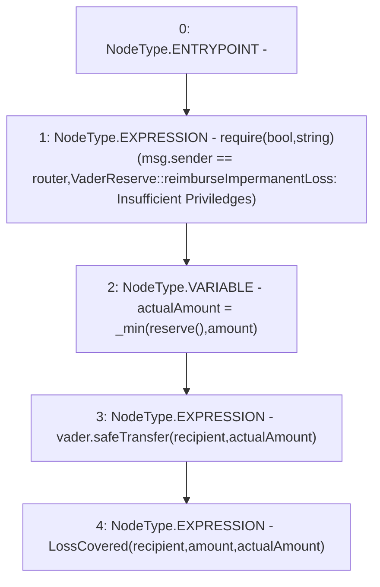

# Context: VaderReserve.reimburseImpermanentLoss

**Contract:** `VaderReserve` (Inherits: Ownable, Context, ProtocolConstants, IVaderReserve)
**Signature:** `reimburseImpermanentLoss(address,uint256)`
**Method Selector ID:** `0xb99573a3`
**Visibility:** `external`
**Environment-Free:** `No (reads EVM state context)`
**Modifiers:** None

### State Variables Interaction
- **Reads:** router, vader
- **Writes:** None

### Assertion Checks & Business Requirements
- require/assert: `require(bool,string)(msg.sender == router,VaderReserve::reimburseImpermanentLoss: Insufficient Priviledges)`

### Environment & Verification Flags
- **Uses Foundry Cheatcodes:** No
- **Has Echidna Properties:** No

### Internal Calls Tree
- None

### External Calls / Value Transfers
- `SafeERC20.LIBRARY_CALL, dest:SafeERC20, function:SafeERC20.safeTransfer(IERC20,address,uint256), arguments:['vader', 'recipient', 'actualAmount'] `

### Control Flow Graph (CFG)


### Source Mapping
Declared in: `certora-ac-datasets/detasets/web3bugs/dataset/web3bugs/52/contracts/reserve/VaderReserve.sol` on lines **76** to **90**

```solidity
    function reimburseImpermanentLoss(address recipient, uint256 amount)
        external
        override
    {
        require(
            msg.sender == router,
            "VaderReserve::reimburseImpermanentLoss: Insufficient Priviledges"
        );

        uint256 actualAmount = _min(reserve(), amount);

        vader.safeTransfer(recipient, actualAmount);

        emit LossCovered(recipient, amount, actualAmount);
    }

```
