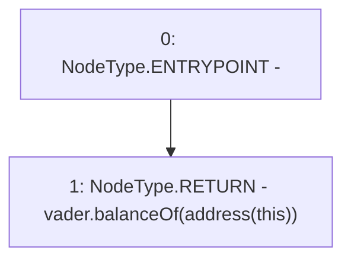

# Context: VaderReserve.reserve

**Contract:** `VaderReserve` (Inherits: Ownable, Context, ProtocolConstants, IVaderReserve)
**Signature:** `reserve() returns (uint256)`
**Method Selector ID:** `0xcd3293de`
**Visibility:** `public`
**Environment-Free:** `Yes`
**Modifiers:** None

### State Variables Interaction
- **Reads:** vader
- **Writes:** None

### Environment & Verification Flags
- **Uses Foundry Cheatcodes:** No
- **Has Echidna Properties:** No

### Internal Calls Tree
- None

### External Calls / Value Transfers
- `IERC20.TMP_114(uint256) = HIGH_LEVEL_CALL, dest:vader(IERC20), function:balanceOf, arguments:['TMP_113']  `

### Control Flow Graph (CFG)


### Source Mapping
Declared in: `certora-ac-datasets/detasets/web3bugs/dataset/web3bugs/52/contracts/reserve/VaderReserve.sol` on lines **43** to **45**

```solidity
    function reserve() public view override returns (uint256) {
        return vader.balanceOf(address(this));
    }

```
