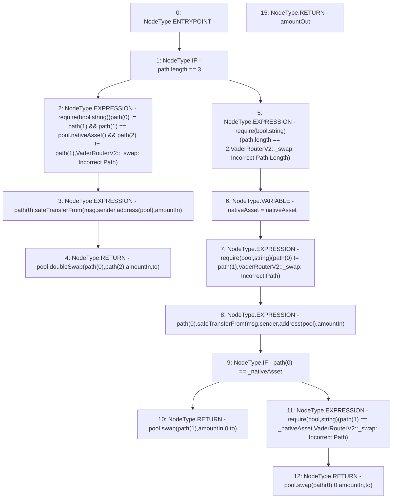

# Context: VaderRouterV2._swap

**Contract:** `VaderRouterV2` (Inherits: Ownable, Context, ProtocolConstants, IVaderRouterV2)
**Signature:** `_swap(uint256,IERC20[],address) returns (uint256)`
**Method Selector ID:** `Internal (No Method ID)`
**Visibility:** `private`
**Environment-Free:** `No (reads EVM state context)`
**Modifiers:** None

### State Variables Interaction
- **Reads:** nativeAsset, pool
- **Writes:** None

### Assertion Checks & Business Requirements
- require/assert: `require(bool,string)(path[0] != path[1] && path[1] == pool.nativeAsset() && path[2] != path[1],VaderRouterV2::_swap: Incorrect Path)`
- require/assert: `require(bool,string)(path.length == 2,VaderRouterV2::_swap: Incorrect Path Length)`
- require/assert: `require(bool,string)(path[0] != path[1],VaderRouterV2::_swap: Incorrect Path)`
- require/assert: `require(bool,string)(path[1] == _nativeAsset,VaderRouterV2::_swap: Incorrect Path)`

### Environment & Verification Flags
- **Uses Foundry Cheatcodes:** No
- **Has Echidna Properties:** No

### Internal Calls Tree
- None

### External Calls / Value Transfers
- `SafeERC20.LIBRARY_CALL, dest:SafeERC20, function:SafeERC20.safeTransferFrom(IERC20,address,address,uint256), arguments:['REF_64', 'msg.sender', 'TMP_168', 'amountIn'] `
- `IVaderPoolV2.TMP_174(uint256) = HIGH_LEVEL_CALL, dest:pool(IVaderPoolV2), function:swap, arguments:['REF_71', '0', 'amountIn', 'to']  `
- `IVaderPoolV2.TMP_171(uint256) = HIGH_LEVEL_CALL, dest:pool(IVaderPoolV2), function:swap, arguments:['REF_68', 'amountIn', '0', 'to']  `
- `IVaderPoolV2.TMP_163(uint256) = HIGH_LEVEL_CALL, dest:pool(IVaderPoolV2), function:doubleSwap, arguments:['REF_59', 'REF_60', 'amountIn', 'to']  `
- `SafeERC20.LIBRARY_CALL, dest:SafeERC20, function:SafeERC20.safeTransferFrom(IERC20,address,address,uint256), arguments:['REF_56', 'msg.sender', 'TMP_161', 'amountIn'] `
- `IVaderPoolV2.TMP_155(IERC20) = HIGH_LEVEL_CALL, dest:pool(IVaderPoolV2), function:nativeAsset, arguments:[]  `

### Control Flow Graph (CFG)


### Source Mapping
Declared in: `certora-ac-datasets/detasets/web3bugs/dataset/web3bugs/52/contracts/dex-v2/router/VaderRouterV2.sol` on lines **297** to **332**

```solidity
    function _swap(
        uint256 amountIn,
        IERC20[] calldata path,
        address to
    ) private returns (uint256 amountOut) {
        if (path.length == 3) {
            require(
                path[0] != path[1] &&
                    path[1] == pool.nativeAsset() &&
                    path[2] != path[1],
                "VaderRouterV2::_swap: Incorrect Path"
            );

            path[0].safeTransferFrom(msg.sender, address(pool), amountIn);

            return pool.doubleSwap(path[0], path[2], amountIn, to);
        } else {
            require(
                path.length == 2,
                "VaderRouterV2::_swap: Incorrect Path Length"
            );
            IERC20 _nativeAsset = nativeAsset;
            require(path[0] != path[1], "VaderRouterV2::_swap: Incorrect Path");

            path[0].safeTransferFrom(msg.sender, address(pool), amountIn);
            if (path[0] == _nativeAsset) {
                return pool.swap(path[1], amountIn, 0, to);
            } else {
                require(
                    path[1] == _nativeAsset,
                    "VaderRouterV2::_swap: Incorrect Path"
                );
                return pool.swap(path[0], 0, amountIn, to);
            }
        }
    }

```
