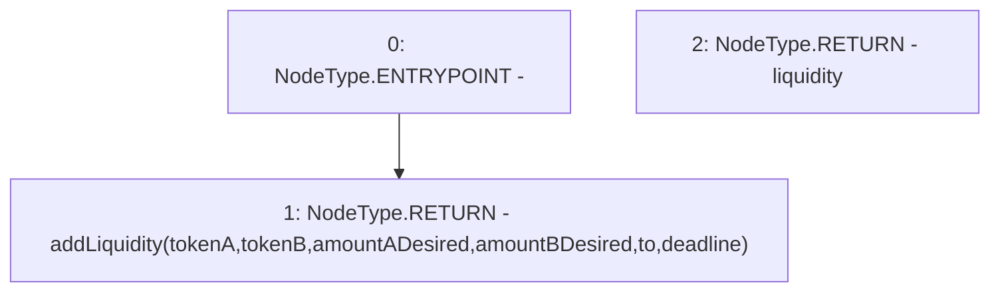

# Context: VaderRouterV2.addLiquidity

**Contract:** `VaderRouterV2` (Inherits: Ownable, Context, ProtocolConstants, IVaderRouterV2)
**Signature:** `addLiquidity(IERC20,IERC20,uint256,uint256,uint256,uint256,address,uint256) returns (uint256)`
**Method Selector ID:** `0xe8e33700`
**Visibility:** `external`
**Environment-Free:** `No (reads EVM state context)`
**Modifiers:** None

### State Variables Interaction
- **Reads:** None
- **Writes:** None

### Environment & Verification Flags
- **Uses Foundry Cheatcodes:** No
- **Has Echidna Properties:** No

### Internal Calls Tree
- None

### External Calls / Value Transfers
- None

### Control Flow Graph (CFG)


### Source Mapping
Declared in: `certora-ac-datasets/detasets/web3bugs/dataset/web3bugs/52/contracts/dex-v2/router/VaderRouterV2.sol` on lines **77** to **96**

```solidity
    function addLiquidity(
        IERC20 tokenA,
        IERC20 tokenB,
        uint256 amountADesired,
        uint256 amountBDesired,
        uint256, // amountAMin = unused
        uint256, // amountBMin = unused
        address to,
        uint256 deadline
    ) external override returns (uint256 liquidity) {
        return
            addLiquidity(
                tokenA,
                tokenB,
                amountADesired,
                amountBDesired,
                to,
                deadline
            );
    }

```
