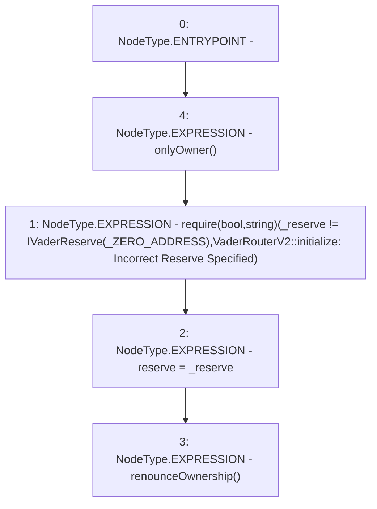

# Context: VaderRouterV2.initialize

**Contract:** `VaderRouterV2` (Inherits: Ownable, Context, ProtocolConstants, IVaderRouterV2)
**Signature:** `initialize(IVaderReserve)`
**Method Selector ID:** `0xc4d66de8`
**Visibility:** `external`
**Environment-Free:** `No (reads EVM state context)`
**Modifiers:**
- `onlyOwner`
  ```solidity
  modifier onlyOwner() {
          _checkOwner();
          _;
      }
  ```

### State Variables Interaction
- **Reads:** _ZERO_ADDRESS
- **Writes:** reserve

### Assertion Checks & Business Requirements
- require/assert: `require(bool,string)(_reserve != IVaderReserve(_ZERO_ADDRESS),VaderRouterV2::initialize: Incorrect Reserve Specified)`

### Environment & Verification Flags
- **Uses Foundry Cheatcodes:** No
- **Has Echidna Properties:** No

### Internal Calls Tree
- None

### External Calls / Value Transfers
- None

### Control Flow Graph (CFG)


### Source Mapping
Declared in: `certora-ac-datasets/detasets/web3bugs/dataset/web3bugs/52/contracts/dex-v2/router/VaderRouterV2.sol` on lines **264** to **273**

```solidity
    function initialize(IVaderReserve _reserve) external onlyOwner {
        require(
            _reserve != IVaderReserve(_ZERO_ADDRESS),
            "VaderRouterV2::initialize: Incorrect Reserve Specified"
        );

        reserve = _reserve;

        renounceOwnership();
    }

```
