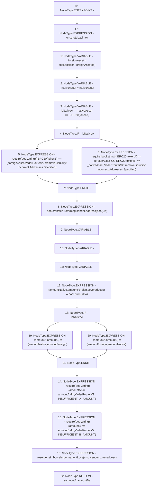

# Context: VaderRouterV2.removeLiquidity

**Contract:** `VaderRouterV2` (Inherits: Ownable, Context, ProtocolConstants, IVaderRouterV2)
**Signature:** `removeLiquidity(address,address,uint256,uint256,uint256,address,uint256) returns (uint256, uint256)`
**Method Selector ID:** `0xbaa2abde`
**Visibility:** `public`
**Environment-Free:** `No (reads EVM state context)`
**Modifiers:**
- `ensure`
  ```solidity
  modifier ensure(uint256 deadline) {
          require(deadline >= block.timestamp, "VaderRouterV2::ensure: Expired");
          _;
      }
  ```

### State Variables Interaction
- **Reads:** nativeAsset, pool, reserve
- **Writes:** None

### Assertion Checks & Business Requirements
- require/assert: `require(bool,string)(IERC20(tokenB) == _foreignAsset,VaderRouterV2::removeLiquidity: Incorrect Addresses Specified)`
- require/assert: `require(bool,string)(IERC20(tokenA) == _foreignAsset && IERC20(tokenB) == _nativeAsset,VaderRouterV2::removeLiquidity: Incorrect Addresses Specified)`
- require/assert: `require(bool,string)(amountA >= amountAMin,VaderRouterV2: INSUFFICIENT_A_AMOUNT)`
- require/assert: `require(bool,string)(amountB >= amountBMin,VaderRouterV2: INSUFFICIENT_B_AMOUNT)`

### Environment & Verification Flags
- **Uses Foundry Cheatcodes:** No
- **Has Echidna Properties:** No

### Internal Calls Tree
- None

### External Calls / Value Transfers
- `IVaderPoolV2.TMP_124(IERC20) = HIGH_LEVEL_CALL, dest:pool(IVaderPoolV2), function:positionForeignAsset, arguments:['id']  `
- `IVaderPoolV2.HIGH_LEVEL_CALL, dest:pool(IVaderPoolV2), function:transferFrom, arguments:['msg.sender', 'TMP_136', 'id']  `
- `IVaderPoolV2.TUPLE_5(uint256,uint256,uint256) = HIGH_LEVEL_CALL, dest:pool(IVaderPoolV2), function:burn, arguments:['id', 'to']  `
- `IVaderReserve.HIGH_LEVEL_CALL, dest:reserve(IVaderReserve), function:reimburseImpermanentLoss, arguments:['msg.sender', 'coveredLoss']  `

### Control Flow Graph (CFG)


### Source Mapping
Declared in: `certora-ac-datasets/detasets/web3bugs/dataset/web3bugs/52/contracts/dex-v2/router/VaderRouterV2.sol` on lines **174** to **228**

```solidity
    function removeLiquidity(
        address tokenA,
        address tokenB,
        uint256 id,
        uint256 amountAMin,
        uint256 amountBMin,
        address to,
        uint256 deadline
    )
        public
        override
        ensure(deadline)
        returns (uint256 amountA, uint256 amountB)
    {
        IERC20 _foreignAsset = pool.positionForeignAsset(id);
        IERC20 _nativeAsset = nativeAsset;

        bool isNativeA = _nativeAsset == IERC20(tokenA);

        if (isNativeA) {
            require(
                IERC20(tokenB) == _foreignAsset,
                "VaderRouterV2::removeLiquidity: Incorrect Addresses Specified"
            );
        } else {
            require(
                IERC20(tokenA) == _foreignAsset &&
                    IERC20(tokenB) == _nativeAsset,
                "VaderRouterV2::removeLiquidity: Incorrect Addresses Specified"
            );
        }

        pool.transferFrom(msg.sender, address(pool), id);

        (
            uint256 amountNative,
            uint256 amountForeign,
            uint256 coveredLoss
        ) = pool.burn(id, to);

        (amountA, amountB) = isNativeA
            ? (amountNative, amountForeign)
            : (amountForeign, amountNative);

        require(
            amountA >= amountAMin,
            "VaderRouterV2: INSUFFICIENT_A_AMOUNT"
        );
        require(
            amountB >= amountBMin,
            "VaderRouterV2: INSUFFICIENT_B_AMOUNT"
        );

        reserve.reimburseImpermanentLoss(msg.sender, coveredLoss);
    }

```
