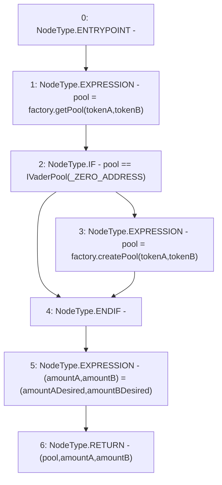

# Context: VaderRouter._addLiquidity

**Contract:** `VaderRouter` (Inherits: Ownable, Context, ProtocolConstants, IVaderRouter)
**Signature:** `_addLiquidity(address,address,uint256,uint256) returns (IVaderPool, uint256, uint256)`
**Method Selector ID:** `Internal (No Method ID)`
**Visibility:** `private`
**Environment-Free:** `Yes`
**Modifiers:** None

### State Variables Interaction
- **Reads:** _ZERO_ADDRESS, factory
- **Writes:** None

### Environment & Verification Flags
- **Uses Foundry Cheatcodes:** No
- **Has Echidna Properties:** No

### Internal Calls Tree
- None

### External Calls / Value Transfers
- `IVaderPoolFactory.TMP_233(IVaderPool) = HIGH_LEVEL_CALL, dest:factory(IVaderPoolFactory), function:getPool, arguments:['tokenA', 'tokenB']  `
- `IVaderPoolFactory.TMP_236(IVaderPool) = HIGH_LEVEL_CALL, dest:factory(IVaderPoolFactory), function:createPool, arguments:['tokenA', 'tokenB']  `

### Control Flow Graph (CFG)


### Source Mapping
Declared in: `certora-ac-datasets/detasets/web3bugs/dataset/web3bugs/52/contracts/dex/router/VaderRouter.sol` on lines **359** to **379**

```solidity
    function _addLiquidity(
        address tokenA,
        address tokenB,
        uint256 amountADesired,
        uint256 amountBDesired
    )
        private
        returns (
            IVaderPool pool,
            uint256 amountA,
            uint256 amountB
        )
    {
        // create the pair if it doesn't exist yet
        pool = factory.getPool(tokenA, tokenB);
        if (pool == IVaderPool(_ZERO_ADDRESS)) {
            pool = factory.createPool(tokenA, tokenB);
        }

        (amountA, amountB) = (amountADesired, amountBDesired);
    }

```
