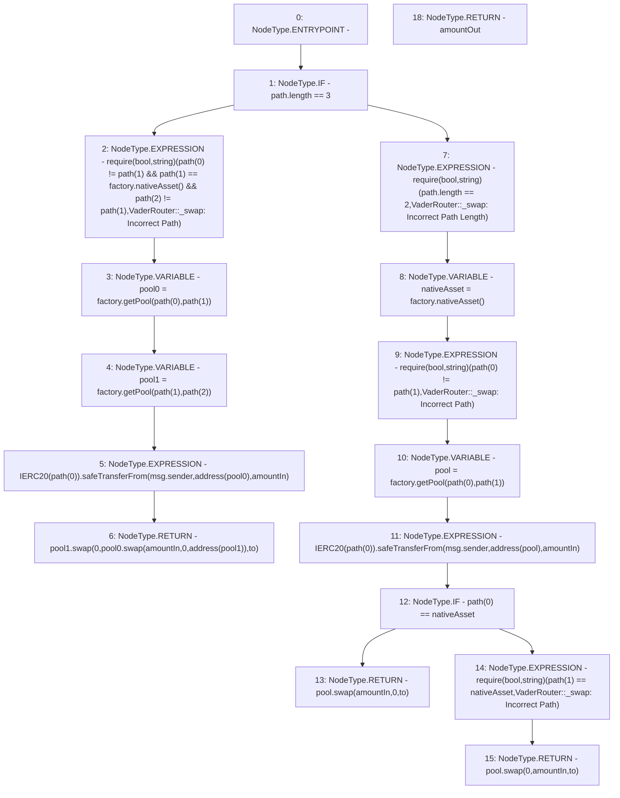

# Context: VaderRouter._swap

**Contract:** `VaderRouter` (Inherits: Ownable, Context, ProtocolConstants, IVaderRouter)
**Signature:** `_swap(uint256,address[],address) returns (uint256)`
**Method Selector ID:** `Internal (No Method ID)`
**Visibility:** `private`
**Environment-Free:** `No (reads EVM state context)`
**Modifiers:** None

### State Variables Interaction
- **Reads:** factory
- **Writes:** None

### Assertion Checks & Business Requirements
- require/assert: `require(bool,string)(path[0] != path[1] && path[1] == factory.nativeAsset() && path[2] != path[1],VaderRouter::_swap: Incorrect Path)`
- require/assert: `require(bool,string)(path.length == 2,VaderRouter::_swap: Incorrect Path Length)`
- require/assert: `require(bool,string)(path[0] != path[1],VaderRouter::_swap: Incorrect Path)`
- require/assert: `require(bool,string)(path[1] == nativeAsset,VaderRouter::_swap: Incorrect Path)`

### Environment & Verification Flags
- **Uses Foundry Cheatcodes:** No
- **Has Echidna Properties:** No

### Internal Calls Tree
- None

### External Calls / Value Transfers
- `IVaderPool.TMP_232(uint256) = HIGH_LEVEL_CALL, dest:pool(IVaderPool), function:swap, arguments:['0', 'amountIn', 'to']  `
- `IVaderPool.TMP_217(uint256) = HIGH_LEVEL_CALL, dest:pool0(IVaderPool), function:swap, arguments:['amountIn', '0', 'TMP_216']  `
- `SafeERC20.LIBRARY_CALL, dest:SafeERC20, function:SafeERC20.safeTransferFrom(IERC20,address,address,uint256), arguments:['TMP_213', 'msg.sender', 'TMP_214', 'amountIn'] `
- `IVaderPoolFactory.TMP_224(IVaderPool) = HIGH_LEVEL_CALL, dest:factory(IVaderPoolFactory), function:getPool, arguments:['REF_71', 'REF_72']  `
- `IVaderPool.TMP_229(uint256) = HIGH_LEVEL_CALL, dest:pool(IVaderPool), function:swap, arguments:['amountIn', '0', 'to']  `
- `SafeERC20.LIBRARY_CALL, dest:SafeERC20, function:SafeERC20.safeTransferFrom(IERC20,address,address,uint256), arguments:['TMP_225', 'msg.sender', 'TMP_226', 'amountIn'] `
- `IVaderPool.TMP_218(uint256) = HIGH_LEVEL_CALL, dest:pool1(IVaderPool), function:swap, arguments:['0', 'TMP_217', 'to']  `
- `IVaderPoolFactory.TMP_211(IVaderPool) = HIGH_LEVEL_CALL, dest:factory(IVaderPoolFactory), function:getPool, arguments:['REF_57', 'REF_58']  `
- `IVaderPoolFactory.TMP_221(address) = HIGH_LEVEL_CALL, dest:factory(IVaderPoolFactory), function:nativeAsset, arguments:[]  `
- `IVaderPoolFactory.TMP_212(IVaderPool) = HIGH_LEVEL_CALL, dest:factory(IVaderPoolFactory), function:getPool, arguments:['REF_60', 'REF_61']  `
- `IVaderPoolFactory.TMP_205(address) = HIGH_LEVEL_CALL, dest:factory(IVaderPoolFactory), function:nativeAsset, arguments:[]  `

### Control Flow Graph (CFG)


### Source Mapping
Declared in: `certora-ac-datasets/detasets/web3bugs/dataset/web3bugs/52/contracts/dex/router/VaderRouter.sol` on lines **304** to **351**

```solidity
    function _swap(
        uint256 amountIn,
        address[] calldata path,
        address to
    ) private returns (uint256 amountOut) {
        if (path.length == 3) {
            require(
                path[0] != path[1] &&
                    path[1] == factory.nativeAsset() &&
                    path[2] != path[1],
                "VaderRouter::_swap: Incorrect Path"
            );

            IVaderPool pool0 = factory.getPool(path[0], path[1]);
            IVaderPool pool1 = factory.getPool(path[1], path[2]);

            IERC20(path[0]).safeTransferFrom(
                msg.sender,
                address(pool0),
                amountIn
            );

            return pool1.swap(0, pool0.swap(amountIn, 0, address(pool1)), to);
        } else {
            require(
                path.length == 2,
                "VaderRouter::_swap: Incorrect Path Length"
            );
            address nativeAsset = factory.nativeAsset();
            require(path[0] != path[1], "VaderRouter::_swap: Incorrect Path");

            IVaderPool pool = factory.getPool(path[0], path[1]);
            IERC20(path[0]).safeTransferFrom(
                msg.sender,
                address(pool),
                amountIn
            );
            if (path[0] == nativeAsset) {
                return pool.swap(amountIn, 0, to);
            } else {
                require(
                    path[1] == nativeAsset,
                    "VaderRouter::_swap: Incorrect Path"
                );
                return pool.swap(0, amountIn, to);
            }
        }
    }

```
