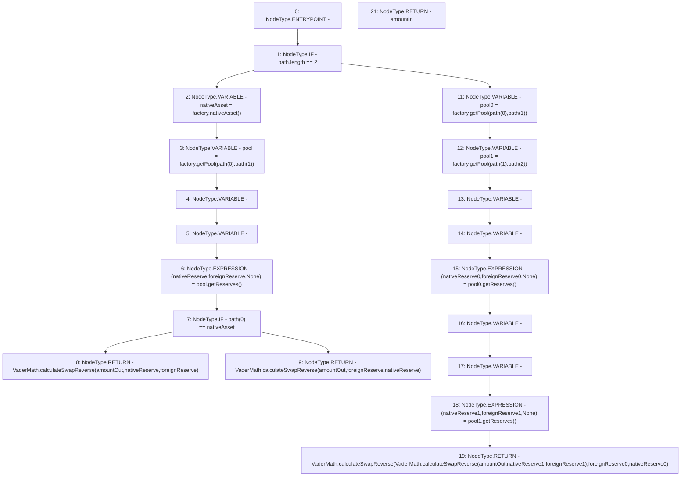

# Context: VaderRouter.calculateInGivenOut

**Contract:** `VaderRouter` (Inherits: Ownable, Context, ProtocolConstants, IVaderRouter)
**Signature:** `calculateInGivenOut(uint256,address[]) returns (uint256)`
**Method Selector ID:** `0x6f6eced2`
**Visibility:** `public`
**Environment-Free:** `Yes`
**Modifiers:** None

### State Variables Interaction
- **Reads:** factory
- **Writes:** None

### Environment & Verification Flags
- **Uses Foundry Cheatcodes:** No
- **Has Echidna Properties:** No

### Internal Calls Tree
- None

### External Calls / Value Transfers
- `IVaderPoolFactory.TMP_243(IVaderPool) = HIGH_LEVEL_CALL, dest:factory(IVaderPoolFactory), function:getPool, arguments:['REF_91', 'REF_92']  `
- `IVaderPoolFactory.TMP_244(IVaderPool) = HIGH_LEVEL_CALL, dest:factory(IVaderPoolFactory), function:getPool, arguments:['REF_94', 'REF_95']  `
- `VaderMath.TMP_245(uint256) = LIBRARY_CALL, dest:VaderMath, function:VaderMath.calculateSwapReverse(uint256,uint256,uint256), arguments:['amountOut', 'nativeReserve1', 'foreignReserve1'] `
- `VaderMath.TMP_246(uint256) = LIBRARY_CALL, dest:VaderMath, function:VaderMath.calculateSwapReverse(uint256,uint256,uint256), arguments:['TMP_245', 'foreignReserve0', 'nativeReserve0'] `
- `IVaderPool.TUPLE_8(uint112,uint112,uint32) = HIGH_LEVEL_CALL, dest:pool(IVaderPool), function:getReserves, arguments:[]  `
- `IVaderPoolFactory.TMP_238(address) = HIGH_LEVEL_CALL, dest:factory(IVaderPoolFactory), function:nativeAsset, arguments:[]  `
- `VaderMath.TMP_242(uint256) = LIBRARY_CALL, dest:VaderMath, function:VaderMath.calculateSwapReverse(uint256,uint256,uint256), arguments:['amountOut', 'foreignReserve', 'nativeReserve'] `
- `IVaderPool.TUPLE_9(uint112,uint112,uint32) = HIGH_LEVEL_CALL, dest:pool0(IVaderPool), function:getReserves, arguments:[]  `
- `VaderMath.TMP_241(uint256) = LIBRARY_CALL, dest:VaderMath, function:VaderMath.calculateSwapReverse(uint256,uint256,uint256), arguments:['amountOut', 'nativeReserve', 'foreignReserve'] `
- `IVaderPoolFactory.TMP_239(IVaderPool) = HIGH_LEVEL_CALL, dest:factory(IVaderPoolFactory), function:getPool, arguments:['REF_84', 'REF_85']  `
- `IVaderPool.TUPLE_10(uint112,uint112,uint32) = HIGH_LEVEL_CALL, dest:pool1(IVaderPool), function:getReserves, arguments:[]  `

### Control Flow Graph (CFG)


### Source Mapping
Declared in: `certora-ac-datasets/detasets/web3bugs/dataset/web3bugs/52/contracts/dex/router/VaderRouter.sol` on lines **394** to **438**

```solidity
    function calculateInGivenOut(uint256 amountOut, address[] calldata path)
        public
        view
        returns (uint256 amountIn)
    {
        if (path.length == 2) {
            address nativeAsset = factory.nativeAsset();
            IVaderPool pool = factory.getPool(path[0], path[1]);
            (uint256 nativeReserve, uint256 foreignReserve, ) = pool
                .getReserves();
            if (path[0] == nativeAsset) {
                return
                    VaderMath.calculateSwapReverse(
                        amountOut,
                        nativeReserve,
                        foreignReserve
                    );
            } else {
                return
                    VaderMath.calculateSwapReverse(
                        amountOut,
                        foreignReserve,
                        nativeReserve
                    );
            }
        } else {
            IVaderPool pool0 = factory.getPool(path[0], path[1]);
            IVaderPool pool1 = factory.getPool(path[1], path[2]);
            (uint256 nativeReserve0, uint256 foreignReserve0, ) = pool0
                .getReserves();
            (uint256 nativeReserve1, uint256 foreignReserve1, ) = pool1
                .getReserves();

            return
                VaderMath.calculateSwapReverse(
                    VaderMath.calculateSwapReverse(
                        amountOut,
                        nativeReserve1,
                        foreignReserve1
                    ),
                    foreignReserve0,
                    nativeReserve0
                );
        }
    }

```
