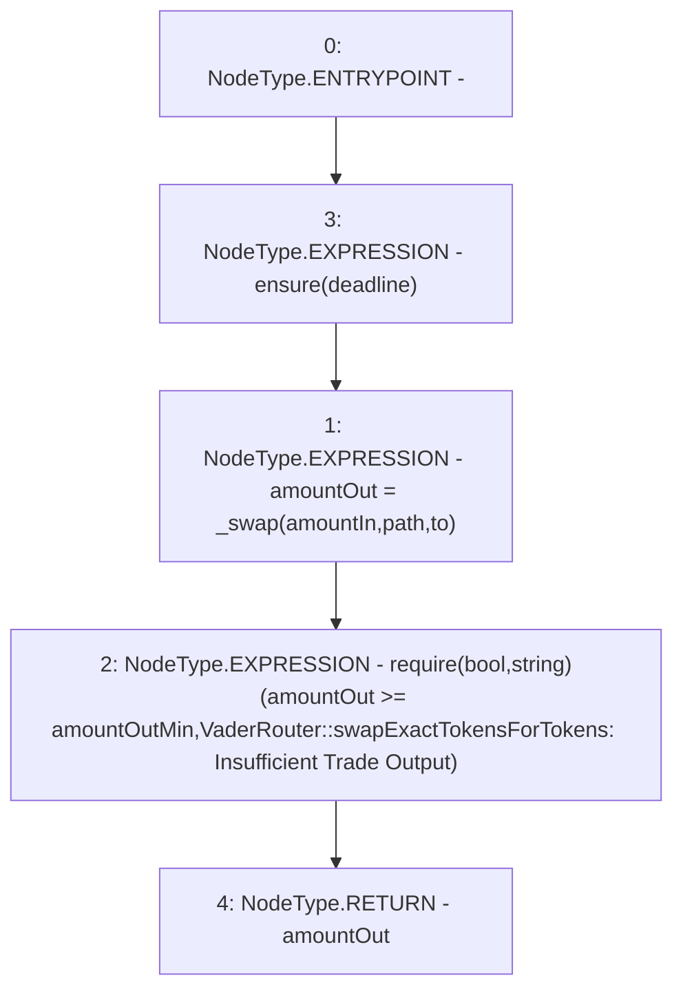

# Context: VaderRouter.swapExactTokensForTokens

**Contract:** `VaderRouter` (Inherits: Ownable, Context, ProtocolConstants, IVaderRouter)
**Signature:** `swapExactTokensForTokens(uint256,uint256,address[],address,uint256) returns (uint256)`
**Method Selector ID:** `0x38ed1739`
**Visibility:** `external`
**Environment-Free:** `No (reads EVM state context)`
**Modifiers:**
- `ensure`
  ```solidity
  modifier ensure(uint256 deadline) {
          require(deadline >= block.timestamp, "VaderRouter::ensure: Expired");
          _;
      }
  ```

### State Variables Interaction
- **Reads:** None
- **Writes:** None

### Assertion Checks & Business Requirements
- require/assert: `require(bool,string)(amountOut >= amountOutMin,VaderRouter::swapExactTokensForTokens: Insufficient Trade Output)`

### Environment & Verification Flags
- **Uses Foundry Cheatcodes:** No
- **Has Echidna Properties:** No

### Internal Calls Tree
- None

### External Calls / Value Transfers
- None

### Control Flow Graph (CFG)


### Source Mapping
Declared in: `certora-ac-datasets/detasets/web3bugs/dataset/web3bugs/52/contracts/dex/router/VaderRouter.sol` on lines **219** to **232**

```solidity
    function swapExactTokensForTokens(
        uint256 amountIn,
        uint256 amountOutMin,
        address[] calldata path,
        address to,
        uint256 deadline
    ) external virtual override ensure(deadline) returns (uint256 amountOut) {
        amountOut = _swap(amountIn, path, to);

        require(
            amountOut >= amountOutMin,
            "VaderRouter::swapExactTokensForTokens: Insufficient Trade Output"
        );
    }

```
