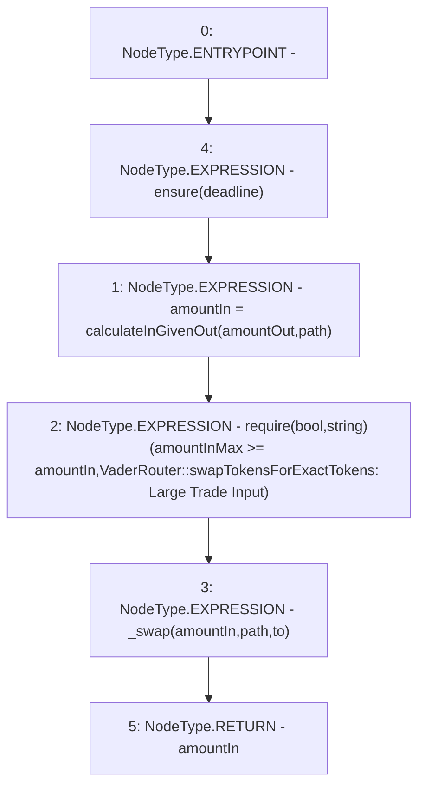

# Context: VaderRouter.swapTokensForExactTokens

**Contract:** `VaderRouter` (Inherits: Ownable, Context, ProtocolConstants, IVaderRouter)
**Signature:** `swapTokensForExactTokens(uint256,uint256,address[],address,uint256) returns (uint256)`
**Method Selector ID:** `0x8803dbee`
**Visibility:** `external`
**Environment-Free:** `No (reads EVM state context)`
**Modifiers:**
- `ensure`
  ```solidity
  modifier ensure(uint256 deadline) {
          require(deadline >= block.timestamp, "VaderRouter::ensure: Expired");
          _;
      }
  ```

### State Variables Interaction
- **Reads:** None
- **Writes:** None

### Assertion Checks & Business Requirements
- require/assert: `require(bool,string)(amountInMax >= amountIn,VaderRouter::swapTokensForExactTokens: Large Trade Input)`

### Environment & Verification Flags
- **Uses Foundry Cheatcodes:** No
- **Has Echidna Properties:** No

### Internal Calls Tree
- None

### External Calls / Value Transfers
- None

### Control Flow Graph (CFG)


### Source Mapping
Declared in: `certora-ac-datasets/detasets/web3bugs/dataset/web3bugs/52/contracts/dex/router/VaderRouter.sol` on lines **244** to **259**

```solidity
    function swapTokensForExactTokens(
        uint256 amountOut,
        uint256 amountInMax,
        address[] calldata path,
        address to,
        uint256 deadline
    ) external virtual ensure(deadline) returns (uint256 amountIn) {
        amountIn = calculateInGivenOut(amountOut, path);

        require(
            amountInMax >= amountIn,
            "VaderRouter::swapTokensForExactTokens: Large Trade Input"
        );

        _swap(amountIn, path, to);
    }

```
