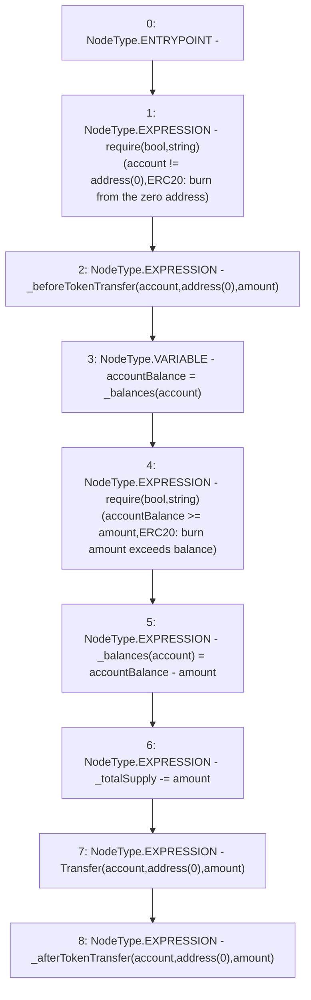

# Context: Vader._burn

**Contract:** `Vader` (Inherits: Ownable, ERC20, IERC20Metadata, IERC20, Context, ProtocolConstants, IVader)
**Signature:** `_burn(address,uint256)`
**Method Selector ID:** `Internal (No Method ID)`
**Visibility:** `internal`
**Environment-Free:** `Yes`
**Modifiers:** None

### State Variables Interaction
- **Reads:** _balances, _totalSupply
- **Writes:** _balances, _totalSupply

### Assertion Checks & Business Requirements
- require/assert: `require(bool,string)(account != address(0),ERC20: burn from the zero address)`
- require/assert: `require(bool,string)(accountBalance >= amount,ERC20: burn amount exceeds balance)`

### Environment & Verification Flags
- **Uses Foundry Cheatcodes:** No
- **Has Echidna Properties:** No

### Internal Calls Tree
- None

### External Calls / Value Transfers
- None

### Control Flow Graph (CFG)


### Source Mapping
Declared in: `certora-ac-datasets/detasets/web3bugs/dataset/web3bugs/52/node_modules/@openzeppelin/contracts/token/ERC20/ERC20.sol` on lines **277** to **293**

```solidity
    function _burn(address account, uint256 amount) internal virtual {
        require(account != address(0), "ERC20: burn from the zero address");

        _beforeTokenTransfer(account, address(0), amount);

        uint256 accountBalance = _balances[account];
        require(accountBalance >= amount, "ERC20: burn amount exceeds balance");
        unchecked {
            _balances[account] = accountBalance - amount;
            // Overflow not possible: amount <= accountBalance <= totalSupply.
            _totalSupply -= amount;
        }

        emit Transfer(account, address(0), amount);

        _afterTokenTransfer(account, address(0), amount);
    }

```
