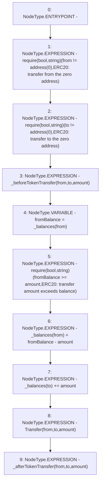

# Context: Vader._transfer

**Contract:** `Vader` (Inherits: Ownable, ERC20, IERC20Metadata, IERC20, Context, ProtocolConstants, IVader)
**Signature:** `_transfer(address,address,uint256)`
**Method Selector ID:** `Internal (No Method ID)`
**Visibility:** `internal`
**Environment-Free:** `Yes`
**Modifiers:** None

### State Variables Interaction
- **Reads:** _balances
- **Writes:** _balances

### Assertion Checks & Business Requirements
- require/assert: `require(bool,string)(from != address(0),ERC20: transfer from the zero address)`
- require/assert: `require(bool,string)(to != address(0),ERC20: transfer to the zero address)`
- require/assert: `require(bool,string)(fromBalance >= amount,ERC20: transfer amount exceeds balance)`

### Environment & Verification Flags
- **Uses Foundry Cheatcodes:** No
- **Has Echidna Properties:** No

### Internal Calls Tree
- None

### External Calls / Value Transfers
- `TMP_124(None) = SOLIDITY_CALL require(bool,string)(TMP_123,ERC20: transfer to the zero address)`
- `TMP_121(None) = SOLIDITY_CALL require(bool,string)(TMP_120,ERC20: transfer from the zero address)`
- `TMP_127(None) = SOLIDITY_CALL require(bool,string)(TMP_126,ERC20: transfer amount exceeds balance)`

### Control Flow Graph (CFG)


### Source Mapping
Declared in: `certora-ac-datasets/detasets/web3bugs/dataset/web3bugs/52/node_modules/@openzeppelin/contracts/token/ERC20/ERC20.sol` on lines **222** to **240**

```solidity
    function _transfer(address from, address to, uint256 amount) internal virtual {
        require(from != address(0), "ERC20: transfer from the zero address");
        require(to != address(0), "ERC20: transfer to the zero address");

        _beforeTokenTransfer(from, to, amount);

        uint256 fromBalance = _balances[from];
        require(fromBalance >= amount, "ERC20: transfer amount exceeds balance");
        unchecked {
            _balances[from] = fromBalance - amount;
            // Overflow not possible: the sum of all balances is capped by totalSupply, and the sum is preserved by
            // decrementing then incrementing.
            _balances[to] += amount;
        }

        emit Transfer(from, to, amount);

        _afterTokenTransfer(from, to, amount);
    }

```
