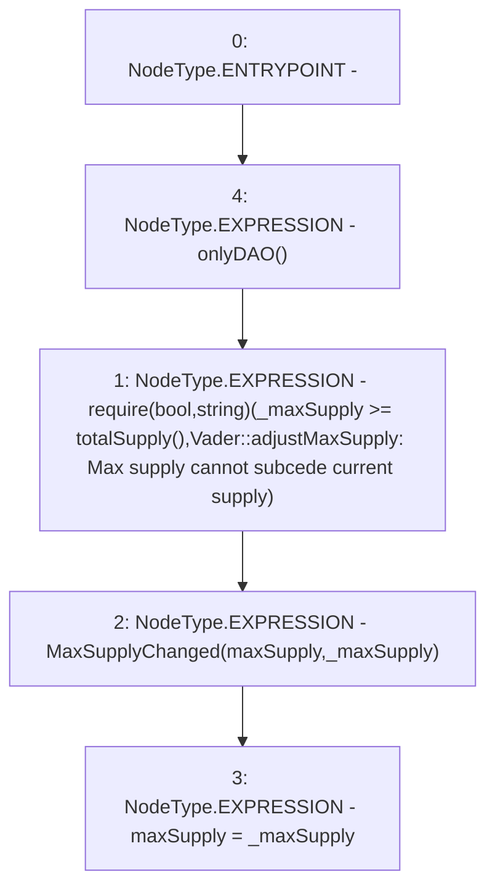

# Context: Vader.adjustMaxSupply

**Contract:** `Vader` (Inherits: Ownable, ERC20, IERC20Metadata, IERC20, Context, ProtocolConstants, IVader)
**Signature:** `adjustMaxSupply(uint256)`
**Method Selector ID:** `0xe30de15e`
**Visibility:** `external`
**Environment-Free:** `No (reads EVM state context)`
**Modifiers:**
- `onlyDAO`
  ```solidity
  modifier onlyDAO() {
          _onlyDAO();
          _;
      }
  ```

### State Variables Interaction
- **Reads:** maxSupply
- **Writes:** maxSupply

### Assertion Checks & Business Requirements
- require/assert: `require(bool,string)(_maxSupply >= totalSupply(),Vader::adjustMaxSupply: Max supply cannot subcede current supply)`

### Environment & Verification Flags
- **Uses Foundry Cheatcodes:** No
- **Has Echidna Properties:** No

### Internal Calls Tree
- None

### External Calls / Value Transfers
- None

### Control Flow Graph (CFG)


### Source Mapping
Declared in: `certora-ac-datasets/detasets/web3bugs/dataset/web3bugs/52/contracts/tokens/Vader.sol` on lines **217** to **224**

```solidity
    function adjustMaxSupply(uint256 _maxSupply) external onlyDAO {
        require(
            _maxSupply >= totalSupply(),
            "Vader::adjustMaxSupply: Max supply cannot subcede current supply"
        );
        emit MaxSupplyChanged(maxSupply, _maxSupply);
        maxSupply = _maxSupply;
    }

```
