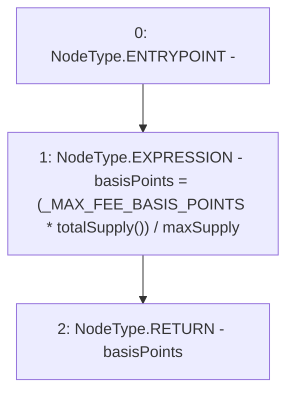

# Context: Vader.calculateFee

**Contract:** `Vader` (Inherits: Ownable, ERC20, IERC20Metadata, IERC20, Context, ProtocolConstants, IVader)
**Signature:** `calculateFee() returns (uint256)`
**Method Selector ID:** `0xe6af35f0`
**Visibility:** `public`
**Environment-Free:** `Yes`
**Modifiers:** None

### State Variables Interaction
- **Reads:** _MAX_FEE_BASIS_POINTS, maxSupply
- **Writes:** None

### Environment & Verification Flags
- **Uses Foundry Cheatcodes:** No
- **Has Echidna Properties:** No

### Internal Calls Tree
- None

### External Calls / Value Transfers
- None

### Control Flow Graph (CFG)


### Source Mapping
Declared in: `certora-ac-datasets/detasets/web3bugs/dataset/web3bugs/52/contracts/tokens/Vader.sol` on lines **89** to **91**

```solidity
    function calculateFee() public view override returns (uint256 basisPoints) {
        basisPoints = (_MAX_FEE_BASIS_POINTS * totalSupply()) / maxSupply;
    }

```
