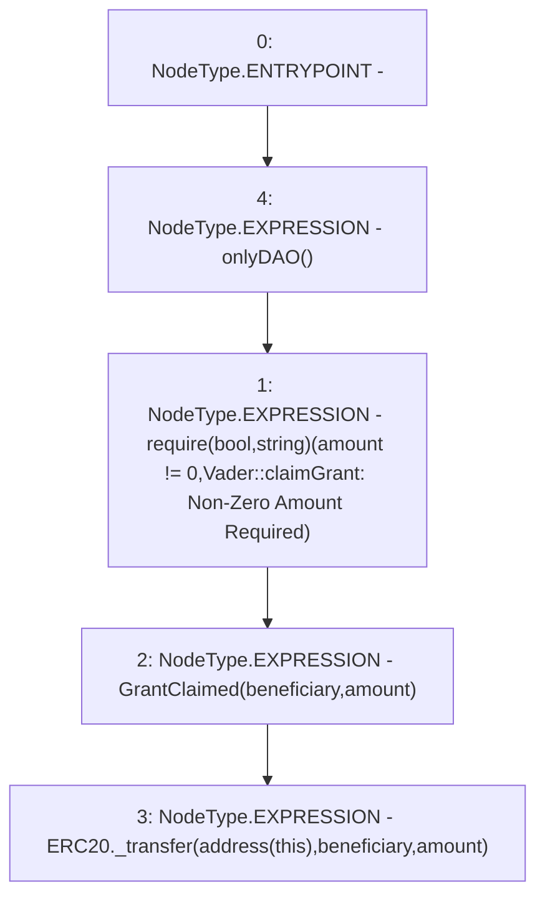

# Context: Vader.claimGrant

**Contract:** `Vader` (Inherits: Ownable, ERC20, IERC20Metadata, IERC20, Context, ProtocolConstants, IVader)
**Signature:** `claimGrant(address,uint256)`
**Method Selector ID:** `0xe9ba3184`
**Visibility:** `external`
**Environment-Free:** `No (reads EVM state context)`
**Modifiers:**
- `onlyDAO`
  ```solidity
  modifier onlyDAO() {
          _onlyDAO();
          _;
      }
  ```

### State Variables Interaction
- **Reads:** None
- **Writes:** None

### Assertion Checks & Business Requirements
- require/assert: `require(bool,string)(amount != 0,Vader::claimGrant: Non-Zero Amount Required)`

### Environment & Verification Flags
- **Uses Foundry Cheatcodes:** No
- **Has Echidna Properties:** No

### Internal Calls Tree
- None

### External Calls / Value Transfers
- None

### Control Flow Graph (CFG)


### Source Mapping
Declared in: `certora-ac-datasets/detasets/web3bugs/dataset/web3bugs/52/contracts/tokens/Vader.sol` on lines **200** to **204**

```solidity
    function claimGrant(address beneficiary, uint256 amount) external onlyDAO {
        require(amount != 0, "Vader::claimGrant: Non-Zero Amount Required");
        emit GrantClaimed(beneficiary, amount);
        ERC20._transfer(address(this), beneficiary, amount);
    }

```
