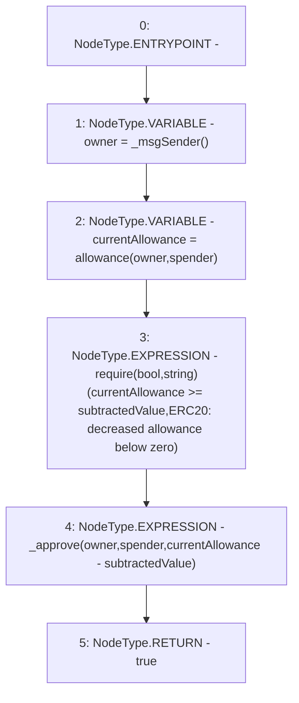

# Context: Vader.decreaseAllowance

**Contract:** `Vader` (Inherits: Ownable, ERC20, IERC20Metadata, IERC20, Context, ProtocolConstants, IVader)
**Signature:** `decreaseAllowance(address,uint256) returns (bool)`
**Method Selector ID:** `0xa457c2d7`
**Visibility:** `public`
**Environment-Free:** `No (reads EVM state context)`
**Modifiers:** None

### State Variables Interaction
- **Reads:** None
- **Writes:** None

### Assertion Checks & Business Requirements
- require/assert: `require(bool,string)(currentAllowance >= subtractedValue,ERC20: decreased allowance below zero)`

### Environment & Verification Flags
- **Uses Foundry Cheatcodes:** No
- **Has Echidna Properties:** No

### Internal Calls Tree
- None

### External Calls / Value Transfers
- None

### Control Flow Graph (CFG)


### Source Mapping
Declared in: `certora-ac-datasets/detasets/web3bugs/dataset/web3bugs/52/node_modules/@openzeppelin/contracts/token/ERC20/ERC20.sol` on lines **197** to **206**

```solidity
    function decreaseAllowance(address spender, uint256 subtractedValue) public virtual returns (bool) {
        address owner = _msgSender();
        uint256 currentAllowance = allowance(owner, spender);
        require(currentAllowance >= subtractedValue, "ERC20: decreased allowance below zero");
        unchecked {
            _approve(owner, spender, currentAllowance - subtractedValue);
        }

        return true;
    }

```
