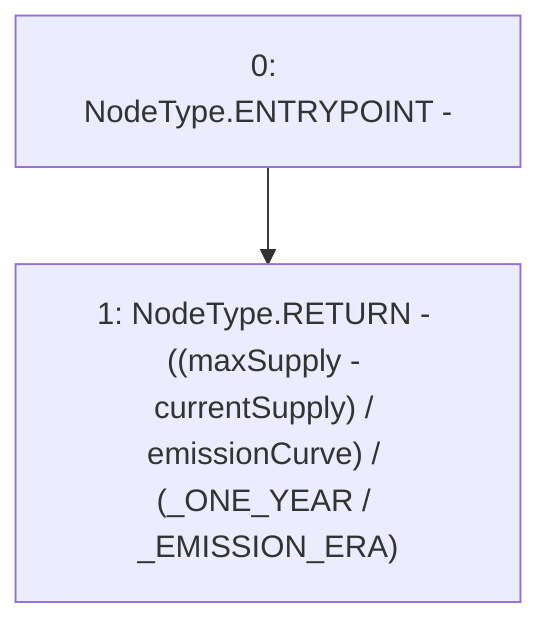

# Context: Vader.getEraEmission

**Contract:** `Vader` (Inherits: Ownable, ERC20, IERC20Metadata, IERC20, Context, ProtocolConstants, IVader)
**Signature:** `getEraEmission(uint256) returns (uint256)`
**Method Selector ID:** `0x7e76e2c5`
**Visibility:** `public`
**Environment-Free:** `Yes`
**Modifiers:** None

### State Variables Interaction
- **Reads:** _EMISSION_ERA, _ONE_YEAR, emissionCurve, maxSupply
- **Writes:** None

### Environment & Verification Flags
- **Uses Foundry Cheatcodes:** No
- **Has Echidna Properties:** No

### Internal Calls Tree
- None

### External Calls / Value Transfers
- None

### Control Flow Graph (CFG)


### Source Mapping
Declared in: `certora-ac-datasets/detasets/web3bugs/dataset/web3bugs/52/contracts/tokens/Vader.sol` on lines **106** to **115**

```solidity
    function getEraEmission(uint256 currentSupply)
        public
        view
        override
        returns (uint256)
    {
        return
            ((maxSupply - currentSupply) / emissionCurve) /
            (_ONE_YEAR / _EMISSION_ERA);
    }

```
